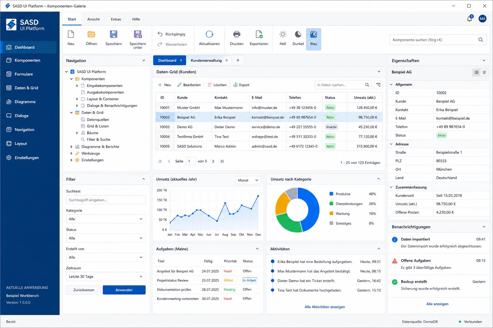

# SASD UI Platform

[](LICENSE)


**A modular, designer-friendly C# WinForms UI platform for consistent SASD desktop applications.**

> **Planning:** Start with the [ROADMAP.md](ROADMAP.md) for the R0–R3 release path and the current implementation priorities.



> **Design target:** The image above is a concept design for the Component Gallery. The repository contains a real executable Gallery, but the concept image still represents the intended visual quality rather than a pixel-identical screenshot of the current implementation.

## Project status

The repository has moved beyond its initial scaffold. The native WinForms foundation, strict Windows CI, architecture checks, UI-state persistence/migration, command infrastructure, data-grid helpers, validation, shell/navigation basics, feedback components and an isolated Krypton R0.2 adapter are implemented and continuously validated.

Current work is closing the remaining **R1 productive-foundation** gaps with small reusable controls before adding optional specialist adapters.

## Product goals

- reduce duplicated UI infrastructure across SASD WinForms applications;
- provide a coherent design system without renaming every primitive WinForms control;
- keep Visual Studio WinForms Designer support practical;
- isolate third-party libraries behind explicit adapter/package boundaries;
- treat DPI, keyboard operation, accessibility, localisation and resource ownership as release criteria;
- support incremental migration of existing SASD applications;
- remain small enough to maintain with realistic SASD capacity.

## Implemented foundation

The current codebase includes, among other things:

- `Sasd.Ui.Core` contracts, result models and theme definitions;
- `SasdForm`, `SasdDialogForm`, `SasdUserControl` and UI-thread dispatch;
- form sections, field layout and validation coordination;
- search, filter, DataGrid, typed grid controller, paging, list/tree defaults and CSV export;
- application commands, bindings and command-bar support;
- navigation host, breadcrumbs, document tabs and prioritized status messages;
- dialogs, detailed errors, busy and cancellable progress handling;
- file/folder dialogs, clipboard and constrained Windows shell integration;
- versioned JSON UI state, backup recovery, incremental migration and recent items;
- native Light/Dark/High-Contrast theming;
- isolated `Krypton.Toolkit` adapter pilot with automated dependency-boundary checks;
- Component Gallery plus dependency-free smoke and architecture checks.

## Current R1 scope

Still planned or being completed for the productive R1 foundation:

- icon service and semantic standard icons;
- notifications;
- drag-and-drop and tray services;
- richer Gallery coverage for all R1 states;
- CRUD/workbench/utility reference applications;
- packaging/release hardening for reusable NuGet consumption;
- designer, DPI, keyboard, accessibility and localisation evidence required by the roadmap gates.

Optional charts, Markdown/code/diff editors, images, barcode/QR, PDF, WebView2, docking, PropertyGrid extensions, wizard and ribbon remain later R2/R3 modules and do not transitively enter a normal CRUD application.

## Architecture at a glance

```text
SASD application
  -> stable SASD component and service APIs
       -> Sasd.Ui.Core
       -> Sasd.Ui.WinForms foundations and feature modules
       -> optional named adapters
            -> Krypton / later approved specialist dependency
```

The architecture follows four important rules:

1. **Contracts first:** Core APIs use SASD and .NET types, not accidental vendor types.
2. **Composition over inheritance:** Behaviour is composed through services, controllers and small base classes.
3. **Designer first:** Public visual controls remain safe and useful in the Visual Studio WinForms Designer.
4. **No megafork:** Normal dependencies and upstream collaboration are preferred over copying projects into one codebase.

These boundaries are not documentation-only: architecture checks in CI reject dependency cycles, Windows leakage into `Sasd.Ui.Core`, product references outside `src/`, and Krypton leakage outside its adapter.

## Repository structure

```text
SASD-UI-Plattform/
├─ src/                    Product projects and isolated adapters
├─ tests/                  Smoke, architecture and planned UI/visual tests
├─ samples/                Component Gallery and reference applications
├─ templates/              Planned project/application templates
├─ docs/
│  ├─ en/                  English repository and project documentation
│  └─ de/                  German companion/source-language documentation
├─ artefacts/              Concept screenshot and architecture diagrams
├─ eng/                    Engineering/release helper assets (not English docs)
├─ build/                  Build and packaging entry points
└─ .github/                CI, issue and pull-request templates
```

`eng/` means **Engineering**. English documentation is under `docs/en/`.

## Documentation

| Document | Purpose |
| --- | --- |
| [Roadmap](ROADMAP.md) | R0–R3 release path, gates and current priorities |
| [English documentation index](docs/en/README.md) | Primary documentation entry point |
| [German documentation index](docs/de/README.md) | German companion/source-language edition |
| [Component catalogue](docs/en/core/01-component-catalog.md) | Market inventory and component classes |
| [Requirements specification](docs/en/core/02-requirements-specification.md) | Requirements, priorities and acceptance criteria |
| [Functional specification](docs/en/core/03-functional-specification.md) | Technical implementation commitments |
| [Architecture](docs/en/core/04-architecture.md) | Modules, runtime, packaging, quality and security architecture |

## Build

Prerequisites:

- Windows 10 or Windows 11;
- .NET 8 SDK;
- Visual Studio 2022 or later with **.NET desktop development** for designer work.

```powershell
dotnet restore SASD.Ui.Platform.sln
dotnet build SASD.Ui.Platform.sln --configuration Release -p:TreatWarningsAsErrors=true
```

GitHub Actions additionally runs architecture checks and the core, UI-state, WinForms-foundation and Krypton smoke suites on a fresh Windows runner.

## Roadmap summary

- **R0.1:** repository, contracts, architecture checks and reproducible build — implemented foundation.
- **R0.2:** native WinForms and isolated Krypton pilot — implemented technical pilot; visual/designer evidence continues.
- **R0.3:** grid, dialogs, state and UI-test pilot — core implementation substantially present; UI automation/visual evidence remains.
- **R1:** productive foundation and first real SASD application adoption — current development focus.
- **R2:** independently approved specialist adapters.
- **R3:** only additional modules with demonstrated product demand.

See [ROADMAP.md](ROADMAP.md) for the detailed criteria; this README intentionally does not replace it.

## Contributing and security

Read [CONTRIBUTING.md](CONTRIBUTING.md) before proposing a component or dependency. Security issues should follow [SECURITY.md](SECURITY.md) and should not initially be disclosed through a public issue.

## Licence

SASD UI Platform is licensed under the [MIT License](LICENSE). Third-party adapters retain their own licences and notices. Inclusion in the component catalogue does not mean that a product's source code or commercial functionality is part of this repository.

---

Copyright © 2026 SASD-GmbH
