# SASD UI Platform - Architekturdokument für C#-WinForms-Komponenten

**Technische Gesamtarchitektur einer wiederverwendbaren Windows-Desktop-Komponentenplattform**

---

**Version:** 0.1  
**Stand:** 23. Juli 2026  
**Status:** Architekturentwurf zur Umsetzung des R0-Entscheidungspiloten  
**Produktlinie:** Windows Desktop / C# / .NET 8 / WinForms  
**Architekturrahmen:** R0-Entscheidungspilot, R1-Fundament, R2-Fachmodule, R3-optionale Module  
**Verantwortlich:** SASD-GmbH

> Abgeleitet aus dem SASD-Komponenten-Katalog, dem Lastenheft und dem Pflichtenheft vom 23. Juli 2026.

<!-- PAGEBREAK -->

# Inhaltsübersicht

1. Management-Zusammenfassung  
2. Zweck, Geltungsbereich und Dokumentenbezug  
3. Architekturtreiber und Qualitätsziele  
4. Systemkontext und Stakeholder  
5. Architekturüberblick  
6. Architekturprinzipien  
7. Logische Modularchitektur  
8. Repository-, Solution- und Paketarchitektur  
9. Laufzeit- und Kompositionsarchitektur  
10. Designsystem, Themes und Icons  
11. Formular-, Validierungs- und View-Architektur  
12. Shell-, Navigations- und Command-Architektur  
13. Datenanzeige-, Grid-, Listen- und Baumarchitektur  
14. Dialog-, Feedback-, Fortschritts- und Fehlerarchitektur  
15. State-, Datei- und Windows-Integrationsarchitektur  
16. Optionale R2-/R3-Adapter und Fachmodule  
17. Öffentliche API und Erweiterungspunkte  
18. Threading, Lifecycle und Ressourcenverwaltung  
19. Sicherheitsarchitektur  
20. Qualitäts-, Performance-, DPI- und Accessibility-Architektur  
21. Testarchitektur  
22. Build-, CI/CD-, Release- und Supply-Chain-Architektur  
23. Verteilung und Nutzung in SASD-Anwendungen  
24. Migration und Einführung  
25. Risiken, Zielkonflikte und bewusste Kompromisse  
26. Architekturentscheidungen (ADR-Register)  
27. Rückverfolgbarkeit und Freigabegates  
28. Zukunftsgrenzen und Plattformregister  
29. Architekturabnahme und Review-Checkliste  
30. Anhänge

<!-- PAGEBREAK -->

# 1. Management-Zusammenfassung

Die SASD UI Platform wird als **modulare, paketierte WinForms-Komponentenplattform** realisiert. Sie ist weder eine Kopie von DevExpress noch ein universelles Framework, das jede Windows-Anwendung vollständig kontrolliert. Ihr Zweck ist enger und für SASD wirtschaftlich sinnvoller: wiederkehrende Desktop-Oberflächen, Bedienmuster und technische Integrationen werden einmal sauber entwickelt, getestet, dokumentiert und anschließend von mehreren SASD-Anwendungen als NuGet-Pakete verwendet.

Die Architektur folgt einem stabilen Kern mit optionalen Adaptern:

- `Sasd.Ui.Core` enthält plattformnahe, aber nicht WinForms-gebundene Verträge, Ergebnis- und Fehlermodelle sowie Designsemantik.
- Die WinForms-Basis kapselt wiederkehrendes Verhalten wie UI-Thread-Wechsel, Busy-/Empty-Zustände, Suche und Basisklassen.
- Fachlich zusammengehörige Module für Shell, Formulare, Datenansichten, Dialoge, Windows-Integration und UI-Zustände bleiben getrennt, dürfen in R1 aber in wenigen NuGet-Paketen ausgeliefert werden.
- Krypton wird in R0 als erste sichtbare Theme- und Control-Implementierung geprüft. Das öffentliche Kernmodell bleibt so gestaltet, dass eine native WinForms-Implementierung möglich bleibt.
- ScottPlot, ScintillaNET, WebView2, PDFsharp/MigraDoc, Docking und andere Spezialbibliotheken werden ausschließlich über getrennte Adapterpakete eingebunden.
- Konsumierende Anwendungen behalten ihre Domänenlogik, Datenzugriffe und fachlichen Workflows. Die UI Platform stellt keine globale Datenbank-, ORM-, Netzwerk- oder Pluginarchitektur bereit.

Die wichtigste Architekturregel lautet:

> **SASD abstrahiert wiederkehrendes Verhalten und stabile Verträge - nicht jede einzelne Eigenschaft eines vorhandenen WinForms-Controls.**

Damit wird vermieden, dass die Plattform zu einem schwerfälligen Ersatz-Framework wird. Ein normaler Button oder eine TextBox bleibt ein normales Control. Eigene SASD-Komponenten entstehen nur, wenn mehrere Controls, Qualitätsregeln, Zustandslogik oder wiederkehrende Interaktion zu einem belastbaren Produktbaustein zusammengefasst werden.

# 2. Zweck, Geltungsbereich und Dokumentenbezug

## 2.1 Zweck des Architekturdokuments

Dieses Dokument dient als verbindlicher technischer Orientierungsrahmen für:

- Aufbau des Monorepos und der Solution,
- Trennung und Abhängigkeit der NuGet-Pakete,
- Gestaltung öffentlicher APIs,
- Einsatz und Isolation von Drittbibliotheken,
- Initialisierung und Laufzeitverhalten,
- Zustands-, Fehler-, Command- und Navigationsflüsse,
- Qualitätssicherung, CI/CD, Versionierung und Einführung,
- spätere Architekturreviews und Änderungsentscheidungen.

Es richtet sich an Entwickler, Reviewer, Maintainer und technische Entscheider. Es ist kein Endbenutzerhandbuch und kein detailliertes Implementierungshandbuch für jede Komponente.

## 2.2 Dokumentenhierarchie

| Dokument | Leitfrage | Verbindlichkeit |
| --- | --- | --- |
| Komponenten-Katalog | Welche Anbieter, Controls und Alternativen existieren? | Recherche- und Entscheidungsgrundlage |
| Lastenheft | Was soll die SASD UI Platform leisten und was nicht? | Produktanforderungen und Abgrenzung |
| Pflichtenheft | Wie werden die Anforderungen technisch umgesetzt und geprüft? | Technischer Leistungsumfang |
| Architekturdokument | Wie wirken Module, Abhängigkeiten und Laufzeitmechanismen als Gesamtsystem zusammen? | Architekturregeln und Strukturentscheidungen |
| ADRs | Warum wurde eine konkrete Architekturentscheidung getroffen? | Änderbare Einzelentscheidungen mit Historie |
| Entwicklerhandbuch | Wie wird eine konkrete Komponente implementiert, getestet und veröffentlicht? | Umsetzungsleitfaden |

Bei Widersprüchen gilt: Lastenheft und Pflichtenheft bestimmen den vereinbarten Umfang. Das Architekturdokument darf diesen Umfang strukturieren und präzisieren, aber nicht stillschweigend erweitern.

## 2.3 Geltungsbereich

Bestandteil sind:

- Windows-Desktop-Anwendungen mit C# und WinForms,
- .NET 8 als R0-/R1-Basis,
- wiederverwendbare Controls, Composite Views, Controller und Services,
- Design Tokens, Themes und Icons,
- Shell, Navigation, Commands, Formulare, Validierung, Grid, Listen, Bäume,
- Dialoge, Fehler, Fortschritt, Benachrichtigungen,
- Windows-, Datei-, Clipboard-, Drag-and-drop-, Tray- und UI-State-Integration,
- optionale R2-Adapter für Charts, Editoren, Medien, PDF, WebView2 und Docking,
- Component Gallery, Templates, Tests und interne Paketverteilung.

Nicht Bestandteil sind Domänenmodell, Geschäftslogik, Datenbankzugriff, Authentifizierung eines Fachprodukts, Serverbetrieb, allgemeine Plugin-Plattform, WPF-, ASPX-, Web-, Java-, Linux-, macOS-, Android- oder iOS-Implementierungen.

# 3. Architekturtreiber und Qualitätsziele

## 3.1 Primäre Architekturtreiber

| Treiber | Architektonische Konsequenz |
| --- | --- |
| Mehrere bestehende SASD-WinForms-Anwendungen | Gemeinsame Pakete und schrittweise Migration statt Neuschreiben aller Anwendungen |
| WinForms-Designer bleibt wichtig | Parameterlose Konstruktoren, keine erzwungene DI im Designer, keine generischen Designer-Controls |
| Kleine SASD-Wartungskapazität | Wenige starke Module, strenge Abgrenzung, Adapter statt Forks, keine Enterprise-Vollsuite |
| Unterschiedliche Anwendungstypen | CRUD-, Workbench-, Utility- und Dashboard-Vorlagen statt einer einzigen starren Shell |
| Moderne Optik ohne Herstellerbindung | Design Tokens und Theme-Service; Krypton als Implementierung, nicht als öffentlicher Vertrag |
| Lange laufende Desktopprozesse | Sauberer Lifecycle, Dispose-Regeln, Handle-/Lecktests und defensive Eventverwaltung |
| Hohe praktische Wiederverwendung | Composite Controls, Services und Controller mit konkretem Nutzen; keine bloßen Umbenennungswrapper |
| Nachvollziehbare Qualität | Component Gallery als ausführbare Spezifikation, UI Automation, visuelle Regression, DPI-/Accessibility-Matrix |

## 3.2 Qualitätsziele in Prioritätsreihenfolge

1. **Wartbarkeit:** Die Plattform muss von einer kleinen Organisation über Jahre verstanden und gepflegt werden können.
2. **Verlässlichkeit:** Optionale Module, beschädigte UI-Zustände oder fehlende Ressourcen dürfen den Anwendungsstart nicht unnötig verhindern.
3. **Nutzbarkeit:** Tastatur, Fokus, verständliche Fehlertexte, konsistente Navigation und gute Standardzustände sind wichtiger als Effekte.
4. **Designerfähigkeit:** R1-Komponenten müssen praktisch mit dem Visual-Studio-WinForms-Designer nutzbar sein.
5. **Austauschbarkeit:** Drittanbieter werden hinter Grenzen gehalten; ihre Typen dürfen nicht unkontrolliert in den Kern auslaufen.
6. **Performance:** Typische Geschäftsanwendungen müssen bei Start, Navigation und Datenanzeige flüssig bleiben.
7. **Erweiterbarkeit:** R2-/R3-Module können ergänzt werden, ohne den R1-Kern neu zu strukturieren.
8. **Portabilität des Wissens:** Designsemantik und UX-Regeln sollen später auf WPF/Web/Java übertragbar sein, nicht jedoch derselbe UI-Code.

## 3.3 Messbare Qualitätsziele

| Ziel | R1-Kriterium |
| --- | --- |
| Startrobustheit | Fehler in UI-State oder optionaler Theme-Ressource führen zu Defaultzustand und Logeintrag, nicht zu einer unverständlichen Startblockade. |
| Designer | Öffentliche visuelle R1-Controls lassen sich im Referenzprojekt öffnen, platzieren, konfigurieren und erneut laden. |
| DPI | Kernansichten funktionieren bei 100, 125, 150, 175 und 200 Prozent ohne abgeschnittene Pflichtinhalte. |
| Accessibility | Kerninteraktionen besitzen zugängliche Namen/Rollen; Fokus bleibt sichtbar; Farben sind nicht alleiniger Informationsträger. |
| Ressourcen | 100 Öffnen-/Schließen-Zyklen verursachen kein fortlaufendes GDI-/USER-Handle-Wachstum. |
| API-Stabilität | Public-API-Baseline verhindert unbeabsichtigte Breaking Changes. |
| Paketverbrauch | Eine typische R1-Anwendung benötigt höchstens wenige direkte SASD-Paketreferenzen und keine Kenntnis interner Adaptertypen. |
| Migration | Mindestens drei reale SASD-Anwendungen übernehmen Kernmodule schrittweise. |

# 4. Systemkontext und Stakeholder

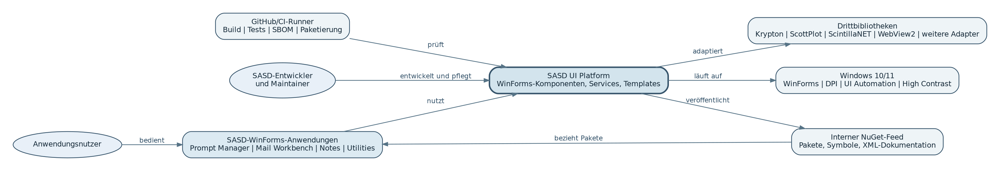

## 4.1 Stakeholder

| Stakeholder | Interesse | Architekturantwort |
| --- | --- | --- |
| SASD-Entwickler | Schneller, konsistenter Aufbau neuer Oberflächen | Templates, Gallery, dokumentierte APIs, stabile Paketversionen |
| Maintainer | Beherrschbarer Wartungsumfang | Modulgrenzen, ADRs, zentrale Abhängigkeiten, Fork-Governance |
| Anwendungsnutzer | Verlässliche, verständliche und zugängliche Bedienung | Fokusregeln, Status, Fehlerdarstellung, Accessibility, High Contrast |
| Fachanwendung | Freiheit bei Domäne und Datenzugriff | UI Platform bleibt fachlich neutral und erzwingt keine ORM-/Datenarchitektur |
| Security-/Lizenzreview | Transparente Lieferkette | SBOM, THIRD-PARTY-NOTICES, Adaptergrenzen, Vulnerability- und Lizenzprüfung |
| Spätere Plattformprojekte | Wiederverwendbare UX-Entscheidungen | Design Tokens, Semantik und Dokumentation werden von Renderingcode getrennt |

## 4.2 Externe Systeme und Grenzen

Die UI Platform interagiert mit Windows, dem .NET-Runtime- und WinForms-Modell, einem internen NuGet-Feed, CI-Runnern sowie ausgewählten Drittbibliotheken. Sie besitzt keine dauerhafte zentrale Serverkomponente. Jede konsumierende Anwendung läuft als eigener Desktopprozess und speichert ihren UI-Zustand in ihrem eigenen Produktverzeichnis.

# 5. Architekturüberblick

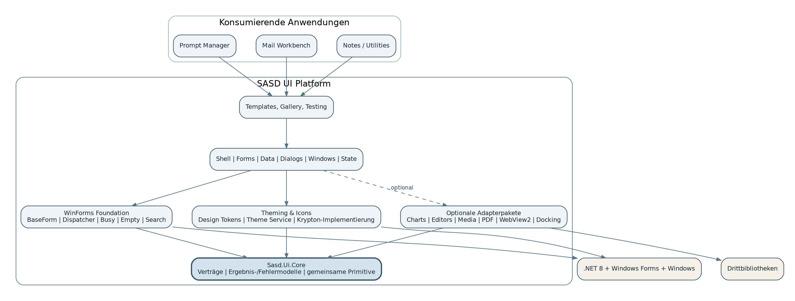

## 5.1 Architekturstil

Die Plattform verwendet eine Kombination aus:

- **modularem Monorepo** für gemeinsame Entwicklung und konsistente Versionierung,
- **layered modular architecture** mit klarer Abhängigkeitsrichtung,
- **Ports-and-Adapters-Prinzip** für Drittbibliotheken und Windows-nahe Integrationen,
- **Composite-Control-Architektur** für wiederkehrende visuelle Bausteine,
- **Service- und Controller-Architektur** für nichtvisuelles Verhalten,
- **Composition Root pro Anwendung** für konkrete Implementierungen.

Sie ist kein klassischer Microservice-Verbund, kein UI-Microfrontend-System und kein allgemeines Plugin-Framework. Die NuGet-Pakete sind logische und veröffentlichbare Module innerhalb eines Desktopprozesses.

## 5.2 Kernzonen

| Zone | Verantwortung | Darf kennen |
| --- | --- | --- |
| Core | Verträge, Tokens, Resultate, Versionierung, neutrale Primitive | .NET BCL, keine WinForms- oder Drittanbieter-UI-Typen |
| WinForms Foundation | Basisklassen, Dispatcher, elementare Composite Controls und Lifecycle-Helfer | Core, System.Windows.Forms |
| Feature Modules | Shell, Forms, Data, Dialogs, Windows, State, Commands | Core/Foundation und explizit erlaubte Feature-Abhängigkeiten |
| Visual Implementation | Mapping der SASD-Semantik auf Krypton oder native Controls | Theme-/Foundation-Verträge und konkrete UI-Bibliothek |
| Optional Adapters | Charts, Editoren, PDF, WebView2, Docking, Medien | Core/Foundation und jeweilige Drittbibliothek |
| Samples/Testing/Templates | Ausführbare Spezifikation, Testhilfen, Starter | nur freigegebene öffentliche Pakete |
| Applications | Fachliche Produkte | öffentliche SASD-Pakete, eigene Domäne und Infrastruktur |

## 5.3 Abhängigkeitsregel

Abhängigkeiten zeigen zum stabileren Kern. `Sasd.Ui.Core` kennt keine WinForms-Typen. Feature-Module dürfen nicht auf konkrete Anwendungen verweisen. Adapterpakete dürfen ihre Drittbibliothek kennen; der Kern kennt die Adapter nicht.

# 6. Architekturprinzipien

## 6.1 Composition over Inheritance

Vererbung wird auf wenige stabile Basisklassen (`SasdForm`, `SasdDialogForm`, `SasdUserControl`) begrenzt. Fachliche Varianten entstehen durch eingebettete Controls, Controller, Services, Optionen und Events. Tiefe Vererbungshierarchien mit überschriebenem Verhalten sind zu vermeiden.

## 6.2 Contracts first, implementation second

Öffentliche Verträge werden anhand der SASD-Anwendungsfälle entworfen. Krypton-, ScottPlot-, ScintillaNET- oder WebView2-Typen erscheinen nur in ausdrücklich herstellerspezifischen Adapterpaketen. Ein Austausch soll möglich sein, ohne die gesamte Anwendung neu zu schreiben.

## 6.3 Designer first

Visuelle Controls müssen designerfähig sein:

- parameterloser Konstruktor,
- keine zwingende externe Dienstauflösung im Konstruktor,
- keine Dateisystem- oder Netzwerkzugriffe im Designer,
- keine generischen Controlklassen im Toolbox-Pfad,
- defensive Erkennung des Designmodus,
- Eigenschaften mit sinnvollen Defaults und serialisierbarem Designerverhalten.

## 6.4 Fail safe and recoverable defaults

Beschädigte Layout-, State- oder Theme-Daten werden validiert. Bei Fehlern wird auf einen sicheren Default zurückgefallen. Reset und Backup sind Teil des Designs. Optionaler Komfort darf die Grundbedienbarkeit nicht blockieren.

## 6.5 One visual system per application

Eine Anwendung verwendet genau eine sichtbare Hauptimplementierung. Krypton, AntdUI und ReaLTaiizor werden nicht zu einer Oberfläche gemischt. Zusätzliche Bibliotheken dürfen nur spezialisierte, optisch integrierbare Funktionen liefern.

## 6.6 No megafork

Aktive Open-Source-Projekte werden als Abhängigkeiten verwendet oder upstream verbessert. Forks benötigen ADR, Lizenzprüfung, Wartungsverantwortung, Updateprozess und Exit-Strategie. Das Zusammenkopieren mehrerer Bibliotheken in einen SASD-Quellbaum ist ausgeschlossen.

## 6.7 Fachliche Neutralität

Die UI Platform kennt keine Bewerbung, E-Mail, Notiz, Aufgabe oder Datenbanktabelle. Sie liefert technische Muster wie Navigation, Dirty-State, Grid, Validation und Status. Die Bedeutung der Daten bleibt bei der Anwendung.

## 6.8 Progressive enhancement

R1 muss ohne R2-/R3-Pakete vollständig nutzbar sein. Charts, WebView2, Docking oder Codeeditor verbessern ausgewählte Anwendungen, dürfen jedoch keine Voraussetzung für Basisshell, Dialoge oder Formulare werden.

# 7. Logische Modularchitektur

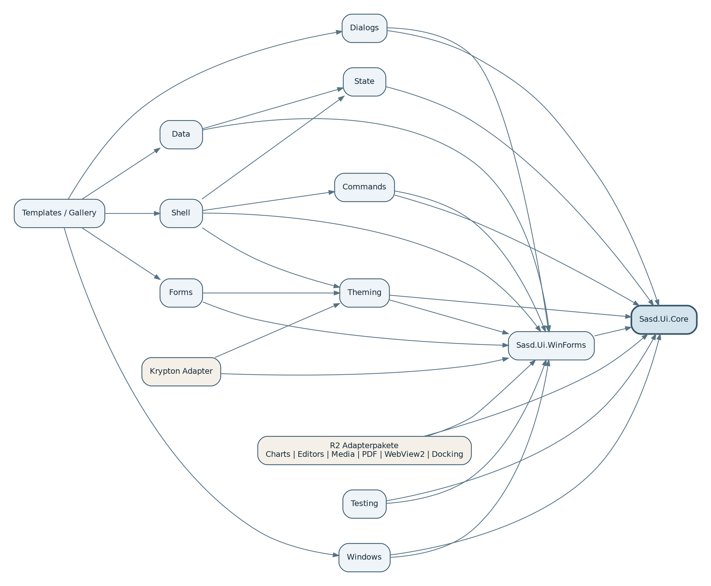

## 7.1 `Sasd.Ui.Core`

Der Core ist die stabilste Schicht und enthält:

- `UiOperationResult` und Fehlercodes,
- Design-Token-Records und Theme-Metadaten,
- semantische Icon- und Command-IDs,
- neutrale Paging-, Filter- und Sortiermodelle, soweit sie UI-übergreifend sinnvoll sind,
- Versions- und Migrationsverträge,
- kleine Hilfstypen ohne WinForms-Abhängigkeit.

Der Core enthält **keine** Controls, Fensterhandles, Message Loops, Dialogimplementierungen oder konkreten Logger.

## 7.2 `Sasd.Ui.WinForms`

Dieses Fundament enthält:

- `SasdForm`, `SasdDialogForm`, `SasdUserControl`,
- `SasdUiDispatcher`,
- `SasdSectionPanel`, `SasdSearchBox`, `SasdEmptyState`, `SasdBusyOverlay`,
- Lifecycle-, Design-Time- und DPI-Helfer,
- Basiskonventionen für AutomationId, AccessibleName und Dispose.

## 7.3 Feature-Module

| Modul | Hauptverantwortung | Verbotene Verantwortung |
| --- | --- | --- |
| Theming | Tokenauswertung, Themewechsel, Icons, High Contrast | Fachtexte, Anwendungseinstellungen außerhalb UI-Themes |
| Commands | Commandzustand, Ausführung, Shortcuts, Binding | Geschäftslogik und Datenzugriff |
| Forms | Layout, Feldadapter, Validation, Summary | Domänenvalidierung als fachliche Wahrheit |
| Shell | Navigation, Tabs, Breadcrumb, Status, Shell-Komposition | Erzwingen einer einzigen App-Navigationsstruktur |
| Data | Grid/List/Tree, Suche, Filter, Paging, Export, UI-State | Datenbankzugriff oder ORM |
| Dialogs | modale und nichtmodale Benutzerinteraktion | Fachentscheidungen ohne Callback/Resultat |
| Windows | Datei, Clipboard, Drag-and-drop, Tray, sichere Shell-Aufrufe | Secrets, beliebige Prozessausführung |
| State | versionierter UI-Zustand, Migration, MRU | fachliche Primärdaten und Zugangsdaten |

## 7.4 Optionale Adapter

Jeder Adapter hat einen kleinen, expliziten Zweck, eigene Tests und einen dokumentierten Lifecycle. Er wird separat paketiert, damit nicht jede Anwendung große oder native Abhängigkeiten übernimmt.

# 8. Repository-, Solution- und Paketarchitektur

## 8.1 Monorepo-Struktur

```text
SASD-UI-Platform/
├─ src/
│  ├─ Sasd.Ui.Core/
│  ├─ Sasd.Ui.WinForms/
│  ├─ Sasd.Ui.WinForms.Theming/
│  ├─ Sasd.Ui.WinForms.Commands/
│  ├─ Sasd.Ui.WinForms.Shell/
│  ├─ Sasd.Ui.WinForms.Forms/
│  ├─ Sasd.Ui.WinForms.Data/
│  ├─ Sasd.Ui.WinForms.Dialogs/
│  ├─ Sasd.Ui.WinForms.Windows/
│  ├─ Sasd.Ui.WinForms.State/
│  ├─ Sasd.Ui.WinForms.Krypton/
│  └─ adapters/
├─ samples/
│  ├─ Sasd.Ui.ComponentGallery/
│  ├─ Sasd.Ui.Sample.Crud/
│  ├─ Sasd.Ui.Sample.Workbench/
│  ├─ Sasd.Ui.Sample.Utility/
│  └─ Sasd.Ui.Sample.Dashboard/
├─ templates/
├─ tests/
│  ├─ unit/
│  ├─ integration/
│  ├─ ui/
│  ├─ visual/
│  └─ architecture/
├─ docs/
│  ├─ architecture/
│  ├─ adr/
│  ├─ components/
│  └─ migration/
├─ eng/
├─ build/
├─ Directory.Build.props
├─ Directory.Packages.props
├─ global.json
└─ SASD.Ui.Platform.sln
```

## 8.2 Projekttrennung versus Pakettrennung

Interne Projekte dürfen fein getrennt sein, damit Abhängigkeiten technisch kontrollierbar bleiben. R1 veröffentlicht dennoch nur wenige verständliche Pakete. Eine Anwendung soll nicht zwanzig Paketreferenzen benötigen, nur um ein Standardfenster zu erstellen.

Vorgesehene erste Paketierung:

| NuGet-Paket | Enthält | Direkte Nutzung |
| --- | --- | --- |
| `Sasd.Ui.Core` | Verträge, Tokens, Resultate | automatisch über UI-Pakete oder für neutrale Integrationen |
| `Sasd.Ui.WinForms` | Foundation sowie zunächst gebündelte Shell-/Form-/Dialog-/State-Bausteine | fast jede SASD-WinForms-Anwendung |
| `Sasd.Ui.WinForms.Krypton` | konkrete sichtbare Implementierung | Anwendungen mit SASD-Standardtheme |
| `Sasd.Ui.WinForms.Data` | Grid/List/Tree, Controller, Filter, Paging | datenorientierte Anwendungen |
| `Sasd.Ui.WinForms.Templates` | Starter und Projektvorlagen | Entwicklung, nicht zwingend Laufzeit |
| R2-Adapterpakete | jeweils nur Spezialfunktion | nur bei nachgewiesenem Bedarf |

## 8.3 Architekturtests für Abhängigkeiten

CI prüft mindestens:

- Core referenziert keine WinForms-Assembly,
- Kernpakete referenzieren keine R2-Adapter,
- Public APIs der Kernpakete enthalten keine Fremdbibliothekstypen,
- Samples referenzieren keine internen Projekte,
- keine Anwendungsklassen liegen in Plattformpaketen,
- Namespaces entsprechen Projektgrenzen,
- zyklische Projektabhängigkeiten sind ausgeschlossen.

# 9. Laufzeit- und Kompositionsarchitektur

## 9.1 Composition Root

Jede Anwendung besitzt genau einen Composition Root in `Program.cs` oder einem kleinen Bootstrapper. Dort werden konkrete Implementierungen ausgewählt. Controls greifen nicht auf einen globalen Service Locator zu.

```csharp
[STAThread]
private static void Main()
{
    ApplicationConfiguration.Initialize();

    using var services = SasdApplicationBootstrapper
        .CreateBuilder()
        .UseProduct("SASD Prompt Manager")
        .UseKryptonTheme()
        .AddStateStore()
        .AddDialogs()
        .AddCommands()
        .Build();

    Application.Run(services.CreateMainForm<PromptManagerShell>());
}
```

Der Builder ist optionaler Komfort. Eine Anwendung darf dieselben Verträge manuell zusammensetzen. Die Plattform darf Microsoft.Extensions.DependencyInjection intern unterstützen, aber weder alle Controls noch den Designer davon abhängig machen.

## 9.2 Startsequenz

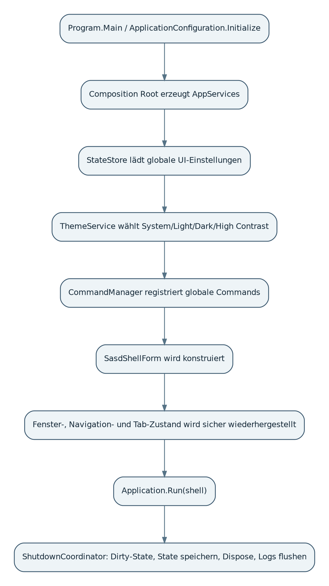

Wesentliche Regeln:

1. `ApplicationConfiguration.Initialize` wird zuerst ausgeführt.
2. Logging und Fehlergrenze werden früh registriert.
3. UI-State wird validiert und gegebenenfalls migriert.
4. Theme und Kultur werden vor dem Aufbau der sichtbaren Shell gesetzt.
5. Globale Commands werden registriert, bevor Menüs und Shortcuts gebunden werden.
6. Fensterzustand wird erst nach Konstruktion und Plausibilitätsprüfung der Monitorgrenzen wiederhergestellt.
7. Beim Shutdown werden Dirty-State, laufende Operationen, State-Speicherung und Dispose in definierter Reihenfolge behandelt.

## 9.3 Lebenszyklus eines Views

Ein View durchläuft:

`Constructed -> DesignTime oder RuntimeInitialized -> Loaded -> Active/Inactive -> Closing -> Disposed`.

Services mit Events liefern Subscription-Tokens oder werden explizit abgemeldet. Ein geschlossener View darf nicht durch globale Theme-, Command- oder Statusservices gehalten werden.

# 10. Designsystem, Themes und Icons

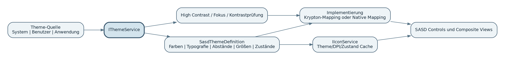

## 10.1 Design Tokens als stabile Semantik

Tokens werden semantisch benannt. Controls fragen beispielsweise `Colors.Error` oder `Spacing.Medium` an und nicht `#D32F2F` oder `8px`. Damit können Light, Dark und High Contrast konsistent umgesetzt und später auf andere UI-Technologien übertragen werden.

Tokenbereiche:

- Farben: Background, Surface, Primary, Text, Border, Focus, Success, Warning, Error, Info, Selection,
- Typografie: Body, Caption, Label, Title, Heading, Monospace,
- Abstände: standardisierte Stufen,
- Größen: Mindesthöhen, Icons, Klickziele, Dialogbreiten,
- Zustände: Normal, Hover, Pressed, Focused, Disabled, ReadOnly, Selected, Error, Warning.

## 10.2 Theme-Service

`IThemeService` besitzt:

- aktives Theme und Theme-ID,
- Systemmodus und High-Contrast-Erkennung,
- Laufzeitwechsel mit kontrollierter Benachrichtigung,
- Validierung und Fallback,
- keine Abhängigkeit von Krypton im öffentlichen Vertrag.

Themewechsel werden nicht durch rekursives unkontrolliertes Durchlaufen beliebiger Controls umgesetzt. Controls, die Themeereignisse benötigen, implementieren einen kleinen Vertrag oder werden von einem Theme-Applier verwaltet.

## 10.3 Krypton als Implementierung

Krypton mappt SASD-Tokens auf Palette, Renderer und passende Standardcontrols. Es ist austauschbar, aber nicht beliebig: Eine zweite Implementierung wird erst gebaut, wenn der R0-Pilot einen konkreten Bedarf zeigt. Abstraktion ohne mindestens einen realen Austauschfall bleibt klein.

## 10.4 Iconarchitektur

Icons werden semantisch über `IIconService` bezogen. Der Cache-Schlüssel enthält Name, Theme, DPI/Größe und Zustand. Dynamische Bitmaps werden kontrolliert disposed oder als klar begrenzte Shared-Ressource verwaltet. Jede Ressource besitzt Lizenz- und Herkunftsnachweis.

# 11. Formular-, Validierungs- und View-Architektur

## 11.1 Basisklassen

- `SasdForm`: Theme, DPI, State-Key, Icon, Standardfehlergrenze und Dispose-Reihenfolge.
- `SasdDialogForm`: Standardaktionen, Validation, Mindestgröße, Fokus, Enter/Escape und Dirty-Abfrage.
- `SasdUserControl`: Theme-/Culture-Ereignisse, Design-Time-Sicherheit und Lifecycle-Hooks.

Fachlogik, Repositoryzugriff und Service-Locator gehören nicht in diese Basisklassen.

## 11.2 `SasdFieldLayout`

Das Formulargitter basiert auf `TableLayoutPanel` und semantischen Spalten. Ein Feld besteht aus Label, Eingabe, Hilfetext, Pflichtmarkierung und Fehlermeldung. Es unterstützt normale WinForms- und Krypton-Controls über Feldadapter. Das Layout darf bei schmalen Dialogen von Label-neben-Control auf Label-über-Control wechseln.

## 11.3 Validierungsarchitektur

Die Plattform koordiniert, sie definiert nicht die fachliche Wahrheit. Quellen können sein:

- DataAnnotations,
- synchrone anwendungsspezifische Regeln,
- optionale asynchrone Prüfungen,
- Control-nahe Format- und Rangeprüfung.

`SasdValidationCoordinator` führt Ergebnisse zusammen, setzt `ErrorProvider`, füllt `SasdValidationSummary` und navigiert zum betroffenen Control. Technische Exceptions werden nicht als Validierungstext ausgegeben.

## 11.4 Presenter-/Controller-Muster

Für komplexere Views wird ein leichtes Presenter- oder Controller-Muster empfohlen:

- View zeigt Daten und leitet Ereignisse weiter,
- Presenter/Controller koordiniert Commands, Validierung und asynchrone Operationen,
- fachliche Services verbleiben außerhalb der UI Platform,
- kein Zwang zu MVVM in WinForms,
- einfache Dialoge dürfen direkt und pragmatisch bleiben.

# 12. Shell-, Navigations- und Command-Architektur

## 12.1 Shellvarianten

Die Plattform bietet gemeinsame Bausteine, aber keine einzige Zwangsschablone:

- CRUD-Shell: Navigation + Liste/Grid + Editor/Details,
- Workbench-Shell: Navigation/Tree + Dokumenttabs + Arbeitsfläche + Details,
- Utility-Shell: Hauptfläche + Status/Progress + optional Tray,
- Dashboard-Shell: Filter + KPI + Charts, erst R2.

## 12.2 Command-System

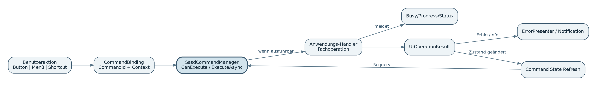

`SasdCommandManager` verwaltet Command-ID, sichtbaren Text, Icon-ID, Shortcut, `CanExecute`, `ExecuteAsync`, Checked-/Visible-Zustand und Fehlerbehandlung. Menü, Toolbar, Kontextmenü und Shortcut binden an dasselbe Commandobjekt.

Commandhandler enthalten keine visuelle Implementierungslogik. Sie geben `UiOperationResult` zurück oder melden Fehler über die gemeinsame Grenze. Lange Operationen verwenden `CancellationToken` und `IProgress<T>`.

## 12.3 Navigation

Navigation verwendet stabile Ziel-IDs und Kontextobjekte. `NavigationChanging` kann Dirty-State oder Berechtigungsprüfungen berücksichtigen. Erst nach erfolgreicher Aktivierung wird `NavigationChanged` ausgelöst. Back-/Forward-Verhalten ist optional pro Shell, nicht global erzwungen.

## 12.4 Dokumenttabs und Dirty-State

Dokumente besitzen stabile IDs, Anzeigenamen, Dirty-State und Close-Policy. Die UI Platform kennt nicht das konkrete Dokumentformat. Wiederherstellung speichert nur sichere Identifikatoren und Ansichtszustände, keine unverschlüsselten fachlichen Inhalte.

## 12.5 Statusmeldungen

Statusmeldungen werden priorisiert und zeitlich begrenzt. Kritische Fehler erscheinen nicht nur in einer flüchtigen Statusleiste. Fortschritt kann global oder kontextbezogen dargestellt werden; konkurrierende Operationen erhalten IDs.

# 13. Datenanzeige-, Grid-, Listen- und Baumarchitektur

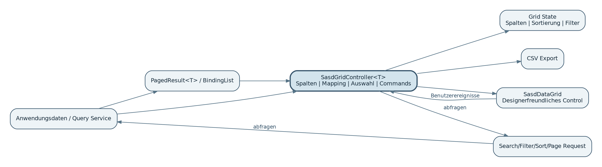

## 13.1 Trennung von Control und typisierter Steuerung

`SasdDataGrid` bleibt designerfreundlich und nicht generisch. `SasdGridController<T>` enthält typisierte Spaltendefinitionen, Mapping, Commands, Auswahl und Validierung. Dadurch werden Designerfähigkeit und Typsicherheit kombiniert.

## 13.2 Query-Modelle

Für große Datenmengen definiert die Plattform neutrale Request-/Resultmodelle:

```csharp
public sealed record GridQuery(
    string? SearchText,
    IReadOnlyList<FilterClause> Filters,
    IReadOnlyList<SortClause> Sorting,
    int PageIndex,
    int PageSize);

public sealed record PagedResult<T>(
    IReadOnlyList<T> Items,
    int TotalCount);
```

Die Anwendung entscheidet, ob die Anfrage durch In-Memory-LINQ, SQLite, REST, Datenbank oder einen anderen Dienst beantwortet wird.

## 13.3 R1-Funktionsgrenze

R1 unterstützt Binding, Spaltendefinition, Sortierung, Suche, Filter, Auswahl, kontrollierte Bearbeitung, Persistenz der Ansicht und CSV-Export. Pivot, universeller Formeleditor, Spreadsheet, OLAP und visueller Querydesigner bleiben ausgeschlossen.

## 13.4 Listen und Bäume

`SasdListView` deckt leichte Listen und optional VirtualMode ab. `SasdTreeView` unterstützt Lazy Loading, Fehlerknoten, Icons und Kontextaktionen. Lazy-Loader müssen Abbruch und Fehlerzustand darstellen können, ohne den gesamten Baum zu blockieren.

## 13.5 UI-State für Datenansichten

Persistiert werden nur Ansichtseinstellungen: Spaltenreihenfolge, Breiten, Sichtbarkeit, Sortierung, gespeicherte Filter und ausgewählte View-Variante. Keine fachlichen Datenzeilen und keine Secrets werden in den UI-State kopiert.

# 14. Dialog-, Feedback-, Fortschritts- und Fehlerarchitektur

## 14.1 Dialogservice

`IDialogService` entkoppelt fachliche Abläufe von konkreten modalen Fenstern. Resultate sind typisiert und unterscheiden Bestätigung, Abbruch und Fehler. Owner-Zuordnung, Fokus und UI-Thread werden zentral behandelt.

## 14.2 Fehlerfluss

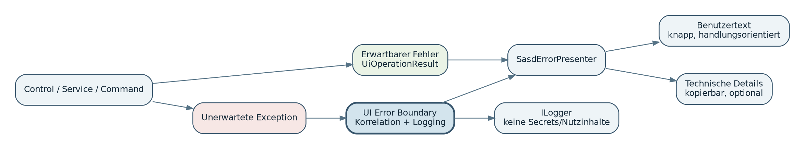

Erwartbare Fehler werden als `UiOperationResult` zurückgegeben. Unerwartete Exceptions laufen durch eine UI-Fehlergrenze, erhalten eine Korrelation und werden geloggt. Der Nutzer sieht eine verständliche Zusammenfassung, kann technische Details bei Bedarf kopieren und erhält nach Möglichkeit eine nächste Handlung.

## 14.3 Notifications

Toast-/Snackbar-Meldungen sind für nichtkritische, nichtmodale Rückmeldungen geeignet. Die Queue verhindert Überlagerungen. Dauer, Aktion, Priorität und Deaktivierung sind konfigurierbar. Kritische Datenverlust- oder Sicherheitsmeldungen dürfen nicht ausschließlich als Toast erscheinen.

## 14.4 Fortschritt und Busy

- kurze Operation: Cursor/kleiner lokaler Busy-State,
- mittlere Operation: `SasdBusyOverlay` mit Status,
- lange oder kritische Operation: `SasdProgressDialog` mit Details und Abbruch,
- Hintergrundoperation: Statusservice plus Notification bei Abschluss.

UI-Freeze durch `.Result`, `.Wait()` oder lange Operationen auf dem UI-Thread ist untersagt.

# 15. State-, Datei- und Windows-Integrationsarchitektur

## 15.1 UI-State

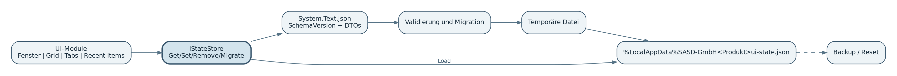

`SasdStateStore` verwendet versionierte JSON-Dokumente unter `%LocalAppData%\SASD-GmbH\<Produkt>`. Schreiben erfolgt über temporäre Datei und atomaren Replace/Move. Schemaänderungen besitzen explizite Migrationen. Bei beschädigter Datei wird Backup/Reset angeboten oder automatisch auf Default zurückgefallen.

## 15.2 Zustandsklassen

| Zustand | Beispiele | Lebensdauer |
| --- | --- | --- |
| globale UI-Einstellungen | Theme, Kultur, allgemeine Dichte | produktweit |
| Fensterzustand | Position, Größe, Maximiert, Monitorplausibilität | pro Fenster/State-Key |
| Viewzustand | Gridspalten, Filter, Tree Expansion, Tabs | pro View und Version |
| Recent Items | Pfade/IDs, Pinning, Zeitstempel | begrenzt und datenschutzbewusst |
| Sitzung | temporäre Auswahl oder Navigation | optional, nicht als Primärdaten |

## 15.3 Datei- und Ordnerdialoge

`IFileDialogService` liefert typisierte Resultate. Filter, Startpfad, Mehrfachwahl und letzte Verzeichnisse werden zentral behandelt. Anwendungscode soll keine schwer testbare Dialoglogik duplizieren.

## 15.4 Clipboard und Drag-and-drop

Clipboardzugriffe sind fehlertolerant und besitzen begrenzte Wiederholversuche, weil die Windows-Zwischenablage temporär gesperrt sein kann. Drag-and-drop validiert erlaubte Typen, Anzahl, Dateigröße und Pfade, bevor die Anwendung Daten verarbeitet.

## 15.5 Sichere Shell-Integration

Prozess- und URL-Aufrufe verwenden Allowlist- oder klar typisierte Operationen. Ungeprüfte Benutzereingaben dürfen nicht als Shellkommando zusammengesetzt werden. `UseShellExecute` und Argumentübergabe werden bewusst konfiguriert.

## 15.6 Tray

Der Tray-Service ist optional. Er definiert eindeutige Regeln für Minimize-to-tray, Schließen, Doppelklick, Menü und Prozessbeendigung. Unsichtbare Hintergrundprozesse ohne erkennbare Beenden-Funktion sind zu vermeiden.

# 16. Optionale R2-/R3-Adapter und Fachmodule

## 16.1 Gemeinsame Adapterregeln

Jedes Adapterpaket benötigt:

- eigene Paket- und Namespacegrenze,
- ADR mit Lizenz, Aktivität, Alternativen und Exit-Strategie,
- Lifecycle- und Dispose-Konzept,
- Security- und Ressourcenprüfung,
- Gallery-Seite und Beispiel,
- keine Rückwirkung auf die R1-Kernpakete.

## 16.2 Adapterübersicht

| Adapter | Geplante Grundlage | Architekturgrenze |
| --- | --- | --- |
| Charts | ScottPlot primär, LiveCharts2 nur bei klarem Dashboardbedarf | neutrale Datenserien und Export; erweiterte Herstelleroptionen nur im Adapter |
| Markdown/Diff | Markdig, DiffPlex | sichere Vorschau, keine unkontrollierte HTML-/Scriptausführung |
| Codeeditor | ScintillaNET | Editor-Lifecycle, große Dateien, Syntaxprofile separat |
| Bild/QR/Barcode | ImageBox/QRCoder/ZXing nach Pilot | Bildressourcen und Dateizugriff kontrolliert |
| PDF | PDFsharp/MigraDoc | dokumentorientiertes Paket ohne WinForms-Abhängigkeit |
| WebView2 | Microsoft WebView2 | Origin-Allowlist, Navigation/Download/Skriptbrücke gehärtet |
| Docking | Krypton Docking/Workspace | Layoutversionierung und Reset bei inkompatiblen Layouts |
| Property Editor | eigene/ausgewählte erweiterte Datenkomponente | Metadaten- und Editorregistrierung, kein universeller Designer |
| Wizard/Ribbon | R3, nur nach Produktbedarf | keine Kernabhängigkeit, Commands bleiben gemeinsame Grundlage |

## 16.3 WebView2-Sicherheitsgrenze

Der WebView-Host startet mit minimalen Rechten und klarer Origin-Allowlist. Navigation, neue Fenster, Downloads, Host-Object-/Skriptbrücke und lokale Ressourcen werden einzeln aktiviert. Beliebige externe Seiten erhalten keinen Zugriff auf privilegierte Hostfunktionen.

# 17. Öffentliche API und Erweiterungspunkte

## 17.1 API-Grundsätze

- SASD- und BCL-Typen im Kern,
- `Options` für erweiterbare Konfiguration statt langer Konstruktorlisten,
- `Result` für erwartbare Ausgänge,
- Events nach .NET-Muster,
- Async-Methoden mit `Async` und `CancellationToken`,
- XML-Dokumentation für alle öffentlichen Typen,
- keine statischen globalen Singletonzugriffe als Standard,
- keine unnötige Abstraktion jeder WinForms-Eigenschaft.

## 17.2 Unterstützte Erweiterungspunkte

| Erweiterungspunkt | Zweck |
| --- | --- |
| Theme Provider | zusätzliche SASD-konforme Themes oder native Implementierung |
| Icon Provider | lizenziertes alternatives Iconset |
| Command Handler | anwendungsspezifische Befehle |
| Validation Rule | fachliche synchrone/asynchrone Prüfung |
| Navigation Target | neue Seiten- oder Dokumenttypen |
| Grid Column Definition | typisierte Darstellung und Editorwahl |
| State Migration | Schemaänderung vorhandener UI-Zustände |
| Dialog Factory | anwendungsspezifische, typisierte Dialoge |
| Adapterpaket | spezialisierte Drittbibliothek hinter eigener Grenze |

## 17.3 Verbotene Erweiterungsmuster

- Reflection-basierter globaler Plugin-Scan im R1-Kern,
- Service Locator innerhalb von Controls,
- öffentliche Rückgabe konkreter Krypton-Typen aus Kernservices,
- beliebige statische Eventbusse ohne Lebenszyklus,
- UI-State als Ersatz für fachliche Persistenz,
- versteckte Threadwechsel ohne dokumentierten Kontext.

# 18. Threading, Lifecycle und Ressourcenverwaltung

## 18.1 UI-Thread-Modell

Alle Controlzugriffe erfolgen auf dem WinForms-UI-Thread. `SasdUiDispatcher` bietet `Invoke`, `BeginInvoke` und `InvokeAsync` mit Cancellation und Dispose-Prüfung. Hintergrundarbeit bleibt außerhalb der Controls und liefert Daten/Progress zurück.

## 18.2 Async-Regeln

- `async void` nur für echte Eventhandler,
- keine `.Wait()`/`.Result` im UI-Pfad,
- jede lange Operation akzeptiert nach Möglichkeit `CancellationToken`,
- Progressmeldungen sind kleine unveränderliche DTOs,
- mehrfach auslösbare Aktionen besitzen Reentrancy-Policy,
- beim Schließen werden laufende Operationen abgebrochen oder kontrolliert abgeschlossen.

## 18.3 Dispose und Eventabonnements

Controls besitzen idempotentes Dispose. Dynamische Bilder, Timer, FileSystemWatcher, WebView2, Editorressourcen und globale Eventsubscriptions werden explizit beendet. Shared-Caches haben klare Eigentümerschaft und Begrenzung.

## 18.4 Ressourcenbudgets

Die Architektur definiert keine harten universellen MB-Grenzen, verlangt aber Messungen für:

- GDI-/USER-Handles,
- managed Heap nach wiederholten Viewzyklen,
- Startzeit der Gallery und Referenzanwendungen,
- Ladezeit großer Grid-/Tree-Daten,
- WebView2-/Editor-Prozesse und Handles,
- Icon-/Bitmap-Caches.

# 19. Sicherheitsarchitektur

## 19.1 Schutzgüter

- Integrität und Verfügbarkeit der Desktopanwendung,
- lokale Benutzerdateien und Konfiguration,
- Secrets der Fachanwendung,
- sichere Ausführung externer Prozesse/URLs,
- Integrität der Paketlieferkette,
- Schutz vor unkontrollierter WebView2-Brücke,
- Vermeidung sensibler Inhalte in Logs und UI-State.

## 19.2 Trust Boundaries

| Grenze | Risiko | Architekturmaßnahme |
| --- | --- | --- |
| Datei/Drag-and-drop -> Anwendung | unerwarteter Typ, Größe, Pfad, manipulierte Datei | Vorvalidierung, erlaubte Typen, klare Übergabe an Fachlogik |
| Anwendung -> Shell/Prozess | Command Injection, falsche URL/Datei | typisierte API, Allowlist, getrennte Argumente |
| Webinhalt -> Host | privilegierter Zugriff | Origin-Allowlist, deaktivierte Bridge per Default, explizite Nachrichtenverträge |
| Drittanbieterpaket -> Produkt | Lizenz-/Supply-Chain-/Vulnerability-Risiko | zentrale Versionen, SBOM, Scans, Adapter und Exit-Strategie |
| UI-State -> Anwendung | manipulierte oder alte JSON-Datei | Schema, Validierung, Migration, Grenzen, Reset |
| Exception/Logging -> Nutzer/Log | Secrets oder Nutzinhalte | Redaction-Regeln, technische Details nur kontrolliert |

## 19.3 Secrets

Die UI Platform speichert keine Passwörter, Tokens oder Credentialobjekte im `SasdStateStore`. Secret-Verwaltung bleibt anwendungsspezifisch. Optionen und Resultate werden so gestaltet, dass sensible Werte nicht automatisch über `ToString`, Logging oder Diagnosedialoge ausgegeben werden.

## 19.4 Dependency Security

Neue Abhängigkeiten benötigen Lizenz, Maintaineraktivität, Signatur/Quelle, transitive Pakete, bekannte Schwachstellen und Updatepfad. Paketversionen werden zentral fixiert. Releaseartefakte enthalten SBOM und Drittanbieterhinweise.

# 20. Qualitäts-, Performance-, DPI- und Accessibility-Architektur

## 20.1 DPI und Mehrmonitor

Die Referenz ist Per-Monitor-DPI. Layout verwendet AutoSize, Dock/Anchor und semantische Abstände statt pixelgenauer Positionierung. Fensterwiederherstellung prüft sichtbare Monitorgrenzen. Bilder und Icons werden passend zur DPI geliefert.

## 20.2 Accessibility

- sinnvolle AccessibleName, Role, Value/State,
- sichtbarer Fokus in allen Themes,
- logische Tab-Reihenfolge,
- Enter/Escape in Dialogen,
- Text/Icon zusätzlich zu Farbe,
- AutomationId-Konvention für UI Automation,
- High Contrast respektiert Systemfarben und reduziert Dekoration,
- manuelle Prüfung mit Accessibility Insights zusätzlich zu automatisierten Checks.

## 20.3 Lokalisierung

Gemeinsame Texte liegen in Plattformressourcen, Fachtexte in Anwendungen. Deutsch und Englisch sind Referenz. Pseudolokalisierung und verlängerte Texte prüfen Reserven. Technische Persistenz verwendet kulturinvariante Werte.

## 20.4 Performanceprinzipien

- keine blockierende I/O im UI-Thread,
- VirtualMode/Paging für große Datenmengen,
- Lazy Loading im Tree,
- begrenzte und messbare Caches,
- Themewechsel ohne unnötige Neuinitialisierung ganzer Anwendungen,
- Charts/Editoren erst bei Sichtbarkeit initialisieren, sofern sinnvoll,
- keine regelmäßigen globalen Polling-Timer ohne Bedarf.

## 20.5 Resilienz

Optionale Services können fehlen; Controls zeigen dann eine definierte reduzierte Funktion oder bleiben unregistriert. Fehlerhafte Layoutdateien, Icons oder Nutzerkonfigurationen besitzen Fallbacks. Die Plattform unterscheidet zwischen kritischem Startfehler und deaktivierbarem Komfortmodul.

# 21. Testarchitektur

## 21.1 Testpyramide

| Ebene | Zweck | Typische Prüflinge |
| --- | --- | --- |
| Unit | schnelle Logikprüfung | Tokens, Commands, State-Migration, Filter, Validatoren |
| Architecture | strukturelle Regeln | Abhängigkeiten, Public API, Namespaces, Fremdtypen |
| Integration | technische Zusammenarbeit | StateStore, Clipboard-Fakes, Dateioperationen, Adapter |
| UI Automation | zentrale Bedienflüsse | Navigation, Dialoge, Grid, Tastatur, Dirty-State |
| Visual Regression | Renderingstabilität | Themes, DPI, Kulturen, Zustände, lange Texte |
| Manual/A11y | schwer automatisierbare Qualität | Designer, High Contrast, Mehrmonitor, Accessibility Insights |

## 21.2 Component Gallery als ausführbare Spezifikation

Jede öffentliche visuelle Komponente erhält eine Gallery-Seite mit:

- Normal, Hover, Focus, Disabled, ReadOnly,
- Busy, Empty, Error und High Contrast, soweit anwendbar,
- Beispielcode,
- Accessibility- und DPI-Hinweisen,
- bekannten Einschränkungen,
- Link zu Anforderungen und ADRs.

## 21.3 Testbarkeit durch Architektur

Services besitzen Interfaces und Fakes. Dialoge, Clipboard, Datei- und Shellzugriffe sind austauschbar. `SasdGridController<T>` kann ohne sichtbares Fenster geprüft werden. UI-Tests verwenden stabile AutomationIds, keine pixelabhängigen Koordinaten als Standard.

# 22. Build-, CI/CD-, Release- und Supply-Chain-Architektur

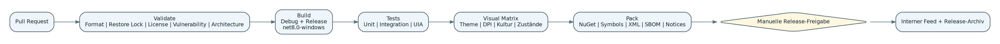

## 22.1 Buildkonfiguration

`Directory.Build.props` aktiviert Nullable, XML-Dokumentation, deterministische Builds und Analyzers. `Directory.Packages.props` hält Paketversionen zentral. `global.json` fixiert die SDK-Familie mit kontrolliertem Roll-forward. Releasebuilds entstehen aus sauberem Checkout.

## 22.2 Pipeline-Gates

1. Validate: Format, Restore Lock, Lizenz, Vulnerability, Architektur.
2. Build: Debug und Release für `net8.0-windows`; zusätzlicher LTS-Build, soweit freigegeben.
3. Test: Unit, Integration, ausgewählte UIA-Flows.
4. Visual: dedizierter Windows-Runner mit Theme-/DPI-/Kulturmatrix.
5. Pack: NuGet, Symbols, XML-Dokumentation, SBOM, THIRD-PARTY-NOTICES.
6. Approve: manuelle Freigabe.
7. Publish: interner Feed, Releasearchiv, Changelog.

## 22.3 Versionierung

SemVer wird verwendet. Während 0.x sind Änderungen möglich, müssen aber dokumentiert sein. Ab 1.0 gelten Public-API-Baseline, Obsolete-Zeitraum und Migrationshinweise verbindlich. `main` bleibt releasefähig; Feature-Branches werden per Pull Request integriert.

# 23. Verteilung und Nutzung in SASD-Anwendungen

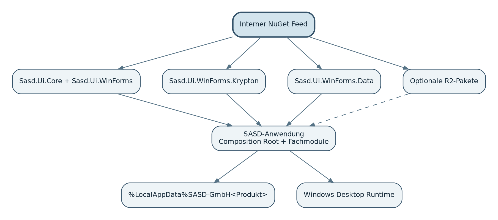

## 23.1 Verteilungsmodell

Die Plattform wird zunächst über einen privaten/interen NuGet-Feed und versionierte Releasearchive verteilt. Anwendungen referenzieren veröffentlichte Pakete, nicht lokale Quellordner oder kopierte DLLs. Symbole und XML-Dokumentation werden mitgeliefert.

## 23.2 Anwendungsstruktur

Eine konsumierende Anwendung behält typischerweise:

```text
SASD-Produkt/
├─ src/
│  ├─ Product.Domain/
│  ├─ Product.Application/
│  ├─ Product.Infrastructure/
│  └─ Product.WinForms/
│      ├─ Program.cs / Composition Root
│      ├─ Shell/
│      ├─ Views/
│      ├─ Presenters/
│      └─ Resources/
└─ tests/
```

Die UI Platform schreibt diese Schichtung nicht zwingend vor, sie unterstützt sie aber. Kleine Utilities dürfen kompakter bleiben.

## 23.3 Kompatibilität

R1 zielt auf .NET 8. Ein zusätzliches aktuelles LTS-Target wird erst eingeführt, wenn Nutzen und Wartungsaufwand klar sind. .NET Framework wird nicht unterstützt. x64 ist Referenz; AnyCPU bleibt möglich, sofern Adapter keine nativen Einschränkungen besitzen.

# 24. Migration und Einführung

## 24.1 Strangler-Ansatz für bestehende Anwendungen

Bestehende Anwendungen werden nicht vollständig neu geschrieben. Migration erfolgt komponentenweise:

1. Theme und Icons,
2. Dialog-/Error-/Progress-Services,
3. State und Recent Items,
4. Search/Filter/Grid-State,
5. FormLayout und Validation,
6. Shell/Navigation nur bei erkennbarem Nutzen,
7. R2-Adapter später.

## 24.2 Pilotanwendungen

| Anwendung | Früher Architekturpilot | Spätere Module |
| --- | --- | --- |
| Prompt Manager | Theme, FormLayout, Dialoge, Grid-State, Search/Filter | Shellteile und erweiterte Datenfunktionen |
| Mail Workbench | Status, Progress, Recent Items, Commands, Shellverträge | Docking, Editor, WebView2 nur bei Bedarf |
| SASD Notes | Tree, Tabs, State, Workbench-Muster | Markdown/Preview, Diff, Docking |
| TaskHost Local/Utility | BaseForm, Dialoge, State, optional Tray | keine großen Module erforderlich |

## 24.3 Migrationskompatibilität

Adapter und Extensions sollen bestehende native Controls integrieren können. Eine Form muss nicht sofort von `SasdForm` erben, wenn ein kleiner Serviceadapter genügt. Die Plattform bevorzugt inkrementelle Vorteile gegenüber einer erzwungenen Big-Bang-Migration.

# 25. Risiken, Zielkonflikte und bewusste Kompromisse

**Krypton-Abhängigkeit:** Krypton wird ausschließlich hinter Theme- und Adaptergrenzen pilotiert. Ein Architekturreview ist erforderlich, wenn wiederkehrende Designerfehler oder unbeherrschbare Sonderbehandlungen auftreten.

**Paketkomplexität:** Projekte bleiben intern fein getrennt, werden in R1 aber zu wenigen verständlichen NuGet-Paketen gebündelt. Ein Stop-Kriterium ist erreicht, wenn eine Basisshell mehr als ungefähr acht direkte SASD-Pakete benötigt.

**Überabstraktion:** Nur stabile, mehrfach genutzte Verträge werden abstrahiert. Das Design wird vereinfacht, sobald eine gewöhnliche Form mehr Boilerplate als eine native WinForms-Umsetzung benötigt.

**Enterprise-Grid-Falle:** Das R1-Grid bleibt auf Geschäftsanwendungen begrenzt. Pivot, Formeln, OLAP und universelle Designer lösen eine Build-vs-Buy-Entscheidung statt automatischer Eigenentwicklung aus.

**Flaky UI Automation:** Automatisiert werden kleine, stabile Kernflüsse mit AutomationIds und kontrollierten Wait-Strategien. Eine dauerhafte Fehlerrate über fünf Prozent ohne Produktfehler erzwingt ein Review der Teststrategie.

**Vermischung von UI-State und Primärdaten:** UI-State enthält nur Ansichtszustände. Sobald fachliche Wiederherstellung ausschließlich von UI-State abhängt, ist die Grenze verletzt.

**Zu frühe Plattformgeneralisierung:** Plattformneutral bleiben Designsemantik, UX-Regeln und geeignete Verträge - nicht der WinForms-Controlcode. Jede Abstraktion, die nur einer hypothetischen WPF-/Web-/Java-Zukunft dient und R1 verlangsamt, wird zurückgestellt.

# 26. Architekturentscheidungen (ADR-Register)

Die folgenden ADRs werden im Repository als einzelne Markdown-Dateien geführt:

- **ADR-001 - WinForms und .NET 8 als R0/R1-Plattform:** angenommen.
- **ADR-002 - Modulares Monorepo mit wenigen veröffentlichten R1-Paketen:** angenommen.
- **ADR-003 - Design Tokens und Theme-Service als stabile visuelle Semantik:** angenommen.
- **ADR-004 - Krypton als erster Pilot, native WinForms-Rückfalloption:** in R0 zu validieren.
- **ADR-005 - Keine flächendeckenden Wrapper für primitive Controls:** angenommen.
- **ADR-006 - Composition Root statt Service Locator in Controls:** angenommen.
- **ADR-007 - `SasdGridController<T>` getrennt vom designerfähigen Grid:** angenommen.
- **ADR-008 - Versionierter JSON-UI-State unter LocalAppData:** angenommen.
- **ADR-009 - Drittbibliotheken nur über Adapter- und Paketgrenzen:** angenommen.
- **ADR-010 - ScottPlot als primärer R2-Chartpilot:** geplant.
- **ADR-011 - ScintillaNET als separater Codeeditoradapter:** geplant.
- **ADR-012 - WebView2 mit Default-Deny-Sicherheitsprofil:** geplant.
- **ADR-013 - UI Automation, visuelle Regression und manuelle A11y-Prüfung:** in R0 zu validieren.
- **ADR-014 - Interner NuGet-Feed vor öffentlicher Veröffentlichung:** angenommen.
- **ADR-015 - Keine Mobile-, macOS- oder Linux-Desktop-Implementierung im aktuellen Scope:** angenommen.
- **ADR-016 - WPF, ASPX/Web und Java als getrennte spätere Produktlinien:** angenommen.

Jede ADR enthält Kontext, Entscheidung, Alternativen, positive/negative Folgen, Lizenz-/Security-Aspekte und Revisionskriterium.

# 27. Rückverfolgbarkeit und Freigabegates

## 27.1 Zuordnung zu Pflichtenheftbereichen

| Architekturkapitel | Pflichtenheftbezug |
| --- | --- |
| Module/Pakete | Kapitel 4-6 und 8-9 |
| Theme/Icon | Kapitel 7 |
| Shell/Commands/Navigation | Kapitel 10 |
| Data/Grid/List/Tree | Kapitel 11 |
| Dialog/Error/Progress | Kapitel 12 |
| Windows/State | Kapitel 13 |
| R2-Fachmodule | Kapitel 14 |
| Qualität/Tests | Kapitel 15 |
| Build/Governance | Kapitel 16 |
| Gallery/Templates/Migration | Kapitel 17-18 |
| Risiken/Nichtziele | Kapitel 19 und 21 |

## 27.2 Architektur-Freigabegates

| Gate | Architekturbeweis |
| --- | --- |
| R0.1 | Repo baut reproduzierbar; Abhängigkeitsregeln als Tests; erste ADRs; Lizenzinventar |
| R0.2 | Krypton/native Pilot; Theme/Token/BaseForm/FormLayout; Designer-, DPI-, Fokus- und High-Contrast-Matrix |
| R0.3 | Grid-/Dialog-/State-Spike; keine Fremdtypen im Kern; UIA- und Visual-Testpilot |
| R1.0 | Kernmodule als NuGet; Gallery; CRUD/Workbench/Utility; erste reale Anwendung produktiv |
| R1.1 | API stabilisiert; drei reale SASD-Projekte nutzen Kernmodule; Migrationsdokumentation |
| R2.0 | jedes Adapterpaket besitzt Security-, Lizenz-, Lifecycle- und Ressourcenprüfung |
| R3 | nachgewiesener Produktbedarf, Wartungsverantwortung und eigenes ADR |

# 28. Zukunftsgrenzen und Plattformregister

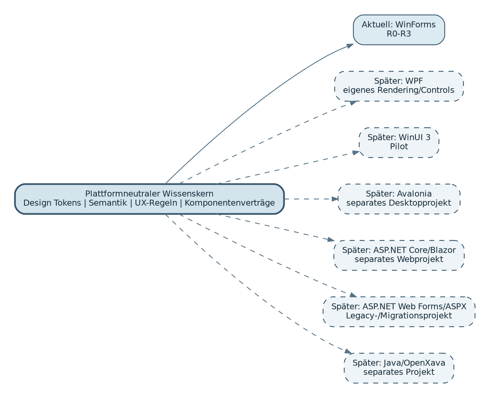

## 28.1 Bewusst wiederverwendbarer Kern

Später wiederverwendbar sind:

- Design Tokens und semantische Benennung,
- UX-Regeln für Fokus, Fehler, Busy, Empty und Navigation,
- Komponentenanforderungen und Beispiele,
- Command-, Result-, Paging- und Filtersemantik, soweit sinnvoll,
- Test- und Qualitätskriterien,
- Architektur- und Lizenzentscheidungen.

Nicht wiederverwendet wird automatisch der WinForms-Controlcode.

## 28.2 Zurückgestellte Projekte

| Produktlinie | Notiz für spätere Wiederaufnahme |
| --- | --- |
| WPF | eigene XAML-/MVVM-nahe Implementierung; Design Tokens und UX-Regeln übernehmen |
| WinUI 3 | Pilot nach WinForms/WPF-Reife; Windows App SDK und Packaging getrennt bewerten |
| Avalonia | nur bei echtem Windows/Linux/macOS-Desktopbedarf; Pro-/OSS-Grenzen erneut prüfen |
| ASP.NET Core/Blazor | moderne Webkomponenten als separates Projekt, ggf. daisyUI/MudBlazor/Fluent UI evaluieren |
| ASP.NET Web Forms/ASPX | Legacy-/Migrationsprojekt; AJAX Control Toolkit nur als historische Funktionsquelle |
| Java/OpenXava | separates Java-Projekt mit modellgetriebenem Ansatz; keine Vermischung mit C#-Paketen |
| Android/iOS/macOS/Linux Desktop | derzeit ausdrücklich nicht geplant; nur im Zukunftsregister erhalten |

# 29. Architekturabnahme und Review-Checkliste

Die Architektur gilt für R0 als freigegeben, wenn folgende Punkte beantwortet und nachweisbar sind:

- [ ] Projekt- und Paketabhängigkeiten entsprechen dem definierten Graphen.
- [ ] `Sasd.Ui.Core` ist frei von WinForms- und Fremd-UI-Abhängigkeiten.
- [ ] Öffentliche Kern-APIs enthalten keine ungewollten Drittanbietertypen.
- [ ] Visual-Studio-Designer funktioniert für alle R1-Controls im Pilotumfang.
- [ ] Krypton kann ohne Änderung der Kernverträge ersetzt oder auf native Controls zurückgeführt werden.
- [ ] Start-, Theme-, Command-, Error- und State-Flows sind in Gallery/Samples demonstriert.
- [ ] UI-State ist versioniert, atomar, migrierbar und frei von Secrets.
- [ ] Threading-, Cancellation- und Dispose-Regeln sind implementiert und getestet.
- [ ] DPI-, Tastatur-, High-Contrast- und Accessibility-Prüfungen besitzen reproduzierbare Checklisten.
- [ ] Architekturtests verhindern zyklische Abhängigkeiten und API-Leaks.
- [ ] CI erzeugt Pakete, Symbole, XML-Dokumentation, SBOM und Drittanbieterhinweise.
- [ ] Mindestens eine reale SASD-Anwendung nutzt veröffentlichte Pakete statt Quellkopien.
- [ ] Offene Abweichungen besitzen ADR, Risiko, Verantwortlichen und Reviewtermin.

# 30. Anhänge

## 30.1 Öffentlicher R1-Komponentenkern

Der geplante R1-Kern umfasst die im Pflichtenheft definierten Basisklassen, Composite Controls, Shell-/Data-/Dialog-/Windows-/State-Services sowie Theme, Icons, Commands und Dispatcher. Ein Eintrag bedeutet nicht zwingend eine eigene sichtbare Controlklasse; Services und Controller sind gleichwertige Produktbausteine.

| Bereich | Kernbausteine |
| --- | --- |
| Basis | SasdForm, SasdDialogForm, SasdUserControl, SasdSectionPanel, SasdSearchBox, SasdEmptyState, SasdBusyOverlay, SasdUiDispatcher |
| Forms | SasdFieldLayout, SasdValidationSummary, ValidationCoordinator und Feldadapter |
| Shell | SasdShellForm, SasdNavigationView, SasdBreadcrumb, SasdDocumentTabs, SasdCommandBar, SasdStatusService/Bar |
| Data | SasdDataGrid, SasdGridController<T>, SasdFilterBar, SasdListView, SasdTreeView |
| Dialogs | SasdDialogService, SasdErrorDialog/Presenter, SasdNotificationService, SasdProgressDialog |
| Windows | SasdFileDialogService, SasdClipboardService, SasdDragDropService, SasdTrayService |
| State | SasdStateStore, SasdRecentItemsService |
| Design | SasdThemeService, SasdIconService, SasdCommandManager |

## 30.2 R2-/R3-Komponentenregister

| Release | Bausteine |
| --- | --- |
| R2 | SasdChartView, SasdKpiCard/Sparkline, SasdMarkdownEditor, SasdCodeEditor, SasdDiffViewer, SasdImageViewer, SasdBarcodeService, SasdPdfDocumentService, SasdWebViewHost, SasdDockWorkspace, SasdPropertyEditor, SasdGridExtensions |
| R3 | SasdWizard, SasdRibbonHost und nur nachgewiesene weitere Zusatzmodule |

## 30.3 Begriffe

| Begriff | Bedeutung |
| --- | --- |
| Adapter | Paket, das einen SASD-Vertrag auf eine konkrete Drittbibliothek oder Windows-Technik abbildet |
| Composite Control | wiederverwendbarer Baustein aus mehreren Controls und gemeinsamem Verhalten |
| Composition Root | einzige Stelle der Anwendung, an der konkrete Implementierungen zusammengesetzt werden |
| Design Token | semantischer Wert für Farbe, Typografie, Abstand, Größe oder Zustand |
| Dirty-State | Kennzeichnung nicht gespeicherter Änderungen eines Dokuments oder Formulars |
| Gallery | ausführbare Spezifikation und Demonstration aller Komponenten/Zustände |
| Public API Baseline | maschinell geprüfte Liste freigegebener öffentlicher Typen und Member |
| State-Key | stabiler Schlüssel für gespeicherten UI-Zustand einer View/eines Fensters |
| UI Error Boundary | zentrale Grenze zur Behandlung unerwarteter UI-Exceptions |

## 30.4 Dokumentenlenkung

| Version | Datum | Änderung |
| --- | --- | --- |
| 0.1 | 23.07.2026 | Erster vollständiger Architekturentwurf aus Komponenten-Katalog, Lastenheft und Pflichtenheft abgeleitet. |

## 30.5 Entscheidungsbasis

- `SASD_UI-Komponenten-Katalog_v2_WinForms-Fokus_2026-07-23.md`
- `SASD_UI-Platform_Lastenheft_WinForms-Komponenten_v0.1_2026-07-23.md`
- `SASD_UI-Platform_Pflichtenheft_WinForms-Komponenten_v0.1_2026-07-23.md`

Die Architektur fügt keine neue Zielplattform hinzu. WPF, moderne Weboberflächen, ASPX/Web Forms, Java/OpenXava und alternative Desktop-/Mobilplattformen bleiben bewusst als getrennte spätere Projekte dokumentiert.
