# SASD UI Platform — Architecture Document for C# WinForms Components

| Attribute | Definition |
| --- | --- |
| Version | 0.1 |
| Date | 23 July 2026 |
| Status | Architecture baseline for R0 implementation |
| Product | SASD UI Platform — C# WinForms Components |
| Organisation | SASD-GmbH |
| Related documents | Requirements specification, functional specification, project roadmap and ADR register |

> This document defines the product, module, runtime, package and quality architecture of the SASD UI Platform. It is intentionally a Windows/WinForms architecture and not a universal rendering framework.

## Contents

1. Executive summary
2. Purpose, scope and document relationships
3. Architecture drivers and quality goals
4. System context and stakeholders
5. Architecture overview
6. Architecture principles
7. Logical module architecture
8. Repository, solution and package architecture
9. Runtime and composition architecture
10. Design system, themes and icons
11. Form, validation and view architecture
12. Shell, navigation and command architecture
13. Data presentation, grid, list and tree architecture
14. Dialog, feedback, progress and error architecture
15. State, file and Windows integration architecture
16. Optional R2/R3 adapters and feature modules
17. Public API and extension points
18. Threading, lifecycle and resource management
19. Security architecture
20. Quality, performance, DPI and accessibility architecture
21. Test architecture
22. Build, CI/CD, release and supply-chain architecture
23. Distribution and use in SASD applications
24. Migration and adoption
25. Risks, trade-offs and deliberate compromises
26. Architecture Decision Record register
27. Traceability and release gates
28. Future boundaries and platform register
29. Architecture acceptance and review checklist
30. Appendices

# 1. Executive summary

The SASD UI Platform is a modular, designer-friendly library for reusable C# WinForms application components. It standardises repeated user-interface infrastructure without taking ownership of application business logic, databases or domain models. Its primary consumers are SASD Prompt Manager, Mail Workbench, Notes, desktop utilities and future Windows business applications.

The architecture consists of a small stable core, WinForms-specific foundations, feature-oriented packages and optional third-party adapters. Applications compose the required modules in their own composition root. They remain able to use native WinForms directly where a SASD component adds no value.

The platform deliberately avoids three common failure modes:

1. a huge fork that combines unrelated open-source projects;
2. a wrapper around every primitive WinForms control;
3. a universal cross-platform abstraction that hides WinForms while implementing only the lowest common denominator.

The architecture instead concentrates on reusable behaviour: themes, application shell, commands, navigation, form layout, validation, data-view productivity, dialogs, error handling, progress, state persistence, Windows integration and quality tooling.

# 2. Purpose, scope and document relationships

## 2.1 Purpose

This document describes the durable structure and rules needed to implement the functional specification. It answers:

- which modules exist and what each owns;
- which dependency directions are allowed;
- how applications compose and configure the platform;
- how third-party libraries are isolated;
- how state, errors, threading, resources and security are handled;
- how architecture is verified continuously.

## 2.2 Document hierarchy

| Document | Primary question |
| --- | --- |
| Component catalogue | Which commercial and open-source capabilities exist? |
| Requirements specification | What must the product provide and what is excluded? |
| Functional specification | How will requirements be implemented and accepted? |
| Architecture document | How is the product structured so the implementation remains maintainable? |
| ADRs | Why was an individual consequential decision made? |
| Roadmap and project plan | In which sequence will the product be delivered? |
| Development/test/release guides | How is day-to-day execution controlled? |

When documents conflict, the requirements specification controls product scope, the functional specification controls implementation commitments, this architecture controls structural rules, and an accepted ADR may refine a specific architecture decision.

## 2.3 Scope

Included:

- Windows 10/11, C#, .NET 8 and WinForms;
- reusable UI infrastructure and component behaviour;
- internal NuGet distribution, samples, templates and Gallery;
- selected optional adapters for approved specialist libraries.

Excluded from the architecture boundary:

- application domains, business processes and repositories;
- mandatory database or ORM technology;
- WPF, WinUI, Avalonia, Blazor, ASPX, Java and mobile implementations;
- spreadsheet, pivot/OLAP, Office editor, full report designer, complex scheduler/Gantt and 3D/GIS engines.

# 3. Architecture drivers and quality goals

## 3.1 Primary drivers

| Driver | Architectural consequence |
| --- | --- |
| Reuse across several existing SASD WinForms applications | Stable packages and application-neutral contracts rather than copied helper classes. |
| Visual consistency | Central tokens, theme service, icon service and one active visual implementation. |
| WinForms Designer productivity | Parameterless constructors, no design-time service dependency and non-generic visual controls. |
| Long-term maintainability | Small core, explicit ownership, limited public packages and architecture tests. |
| Third-party independence | Adapter boundaries, no vendor types in core and documented exit strategies. |
| Safe incremental adoption | Strangler migration, compatibility with native controls and no all-or-nothing application rewrite. |
| Accessibility and DPI | Built into component contracts, Gallery states and release gates rather than postponed polish. |
| One-person/small-team feasibility | Avoid controls whose complexity equals a separate commercial product. |

## 3.2 Quality goals in priority order

1. **Maintainability and clarity** — a developer can locate ownership and understand dependencies quickly.
2. **Reliability and recoverability** — UI infrastructure failures do not corrupt user data or prevent startup.
3. **Usability and consistency** — common interactions behave the same across applications.
4. **Designer compatibility** — components remain practical in Visual Studio WinForms Designer.
5. **Accessibility and DPI correctness** — keyboard, UI Automation, High Contrast and scaling are release criteria.
6. **Extensibility without core pollution** — optional features enter through packages and contracts.
7. **Performance** — common views remain responsive for the defined reference workloads.
8. **Portability of concepts** — contracts and tokens may inform later platforms, but current code is not forced to be cross-platform.

## 3.3 Measurable goals

| Goal | Measure |
| --- | --- |
| Clean dependency direction | Architecture tests pass with no forbidden package or vendor references. |
| Startup resilience | Corrupted optional state/theme/layout is reset or ignored without blocking startup. |
| Designer operation | Public R1 visual controls load, edit, save and reopen in the reference Visual Studio Designer. |
| DPI | Gallery passes 100%, 125%, 150% and 200% plus mixed-monitor movement. |
| Accessibility | Keyboard-only core flows pass; meaningful UIA names/roles/states exist. |
| Resource stability | Repeated form cycles show no sustained GDI/USER handle or object retention growth. |
| Package isolation | Installing an R1 core package does not bring R2 chart/editor/browser dependencies. |
| Adoption | At least two real SASD applications consume released packages before R1 acceptance. |

# 4. System context and stakeholders

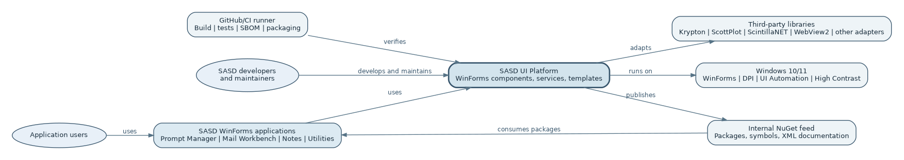

## 4.1 Stakeholders

| Stakeholder | Need |
| --- | --- |
| SASD application developer | Predictable components, samples, documentation and safe extension points. |
| SASD product owner | Controlled scope, reusable investment and visible roadmap. |
| End user | Consistent, responsive, accessible and recoverable desktop applications. |
| Maintainer | Clear package ownership, diagnostics, tests and upgrade paths. |
| Security/licence reviewer | Dependency inventory, provenance, SBOM, safe defaults and notices. |
| Future platform teams | Documented concepts that can be re-evaluated for WPF, Web or Java without coupling current code. |

## 4.2 External systems and boundaries

The platform interacts with:

- consuming SASD WinForms applications;
- Windows shell, file system, clipboard, notification area and accessibility APIs;
- Visual Studio Designer and .NET SDK tooling;
- internal NuGet feed and CI runners;
- optional third-party libraries and WebView2 runtime;
- application-owned data sources through interfaces supplied by the consuming application.

The platform never owns the consuming application's domain database. Its persistent data is limited to versioned UI state and component preferences.

# 5. Architecture overview

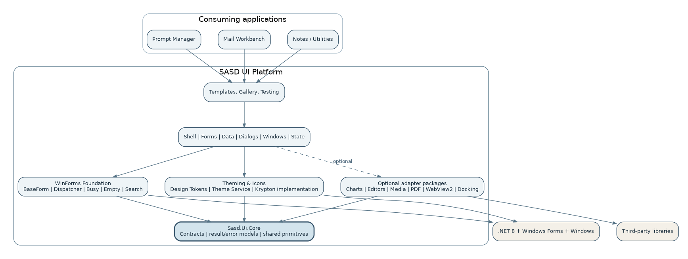

## 5.1 Architecture style

The platform uses a **modular layered library architecture with ports/adapters at vendor boundaries**. It is not a standalone server and does not impose a complete application framework. Applications reference packages and compose services in process.

Relevant patterns:

- composition root;
- façade and adapter;
- controller/presenter around designer controls;
- command pattern;
- strategy/provider contracts;
- versioned state DTOs;
- progressive enhancement;
- executable specification through the Component Gallery.

## 5.2 Core zones

| Zone | Contents | Stability expectation |
| --- | --- | --- |
| Core contracts | Tokens, result models, identifiers, versioning and application-neutral interfaces | Highest |
| WinForms foundation | Base forms/views, dispatcher and composite utility controls | High |
| Platform features | Theming, commands, shell, forms, data, dialogs, Windows and state | High after R1 |
| Vendor adapters | Krypton, ScottPlot, ScintillaNET, WebView2, docking and other optional integrations | Replaceable and separately versioned |
| Samples/templates | Gallery and reference applications | May evolve faster but must stay executable |
| Tooling/tests | Architecture, UIA, visual, resource, licence and packaging controls | Internal, versioned with product |

## 5.3 Dependency rule

All dependencies point inward toward contracts and foundations. Applications may depend on selected modules and adapters. Core and general feature packages never depend on an application, its domain model or an optional adapter.

# 6. Architecture principles

## 6.1 Composition over inheritance

Inheritance is restricted to `SasdForm`, `SasdDialogForm`, `SasdUserControl` and a small number of proven component bases. Behaviour such as validation, state, command binding and data querying is composed through services and controllers. Deep framework-specific inheritance trees are prohibited.

## 6.2 Contracts first, implementation second

Public behaviour is designed around SASD concepts before a library is selected. The contract is kept only when it represents a real stable need rather than a forced generic abstraction.

## 6.3 Designer first

Visual controls:

- have parameterless constructors;
- render a safe preview without runtime services;
- avoid I/O and background work in constructors;
- do not use open generic visual base classes;
- protect runtime-only code with reliable design-mode handling;
- preserve generated designer code ownership.

## 6.4 Fail-safe and recoverable defaults

Missing or invalid preferences fall back to defaults. State writes are atomic. Optional adapter failure results in a disabled feature or clear error, not a failed application bootstrap.

## 6.5 One visual system per application

A consuming application activates one visual implementation. Tokens allow common semantics, but multiple visible suites are not mixed simply because individual controls look attractive.

## 6.6 No megafork

Dependencies remain normal upstream packages whenever possible. Contribution upstream is preferred. A temporary patch fork is allowed only with a documented issue, tests and removal plan. Permanent forks require governance approval.

## 6.7 Domain neutrality

The platform does not know prompts, emails, notes, customers or tasks. Samples may use those concepts, but published packages accept generic view models and provider contracts.

## 6.8 Progressive enhancement

An application can begin with Core plus WinForms, add Krypton, then add Data or Shell, and later choose R2 adapters. No specialist module is required for the foundation.

# 7. Logical module architecture

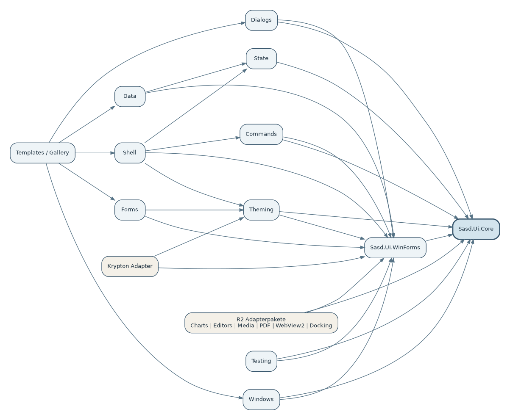

## 7.1 `Sasd.Ui.Core`

Owns:

- semantic design-token records;
- common IDs and schema-version abstractions;
- result/error contracts;
- lightweight extension contracts that do not reference WinForms;
- shared localisation and compatibility metadata where platform-neutral.

It must not reference `System.Windows.Forms`, Krypton or other visual libraries.

## 7.2 `Sasd.Ui.WinForms`

Owns:

- WinForms base classes;
- UI-thread dispatcher;
- designer-safety helpers;
- section, search, empty and busy composites;
- common WinForms extension methods;
- lifecycle and disposal conventions.

It may reference Core and WinForms only.

## 7.3 Feature modules

| Module | Owns | Does not own |
| --- | --- | --- |
| Theming | Theme service, token mapping and icon resolution | Application branding decisions outside token inputs |
| Commands | Command state, shortcuts and surface bindings | Business command implementation |
| Shell | Regions, navigation, tabs, breadcrumbs and status | Application page contents |
| Forms | Field layout and validation coordination | Domain validation policy |
| Data | Grid/list/tree behaviour, query descriptions and state | ORM, SQL and application repositories |
| Dialogs | Modal/non-modal presentation and progress | Business exception translation rules beyond supplied messages |
| Windows | File, clipboard, drag/drop, tray and shell services | Arbitrary process execution |
| State | UI state storage, migration and MRU | Business records or secrets |

## 7.4 Optional adapters

Every optional adapter:

- lives in a named package;
- owns its third-party references;
- maps SASD concepts to vendor APIs;
- has an explicit lifecycle and security section;
- can be omitted without changing the R1 core;
- declares whether vendor-specific escape hatches are public.

# 8. Repository, solution and package architecture

## 8.1 Monorepo structure

```text
SASD-UI-Platform/
├─ src/                    product projects
│  ├─ Sasd.Ui.Core/
│  ├─ Sasd.Ui.WinForms/
│  ├─ Sasd.Ui.WinForms.Theming/
│  ├─ Sasd.Ui.WinForms.Commands/
│  ├─ Sasd.Ui.WinForms.Shell/
│  ├─ Sasd.Ui.WinForms.Forms/
│  ├─ Sasd.Ui.WinForms.Data/
│  ├─ Sasd.Ui.WinForms.Dialogs/
│  ├─ Sasd.Ui.WinForms.Windows/
│  ├─ Sasd.Ui.WinForms.State/
│  ├─ Sasd.Ui.WinForms.Krypton/
│  └─ adapters/
├─ samples/                executable examples
├─ templates/              approved starters
├─ tests/                  unit, integration, UI, visual and architecture
├─ docs/                   English and German documentation
├─ artefacts/              screenshots and architecture diagrams
├─ eng/                    engineering scripts and policy files
├─ build/                  packaging/build entry points
└─ .github/                issues, pull requests and workflows
```

## 8.2 Project separation versus package separation

Repository projects are separated early to enforce ownership. Public NuGet packages are consolidated initially to reduce consumer complexity. Project boundaries therefore express architecture; package boundaries express a stable consumption contract. They may differ until R1 APIs settle.

Rules:

- circular project references are prohibited;
- feature projects reference only lower-level projects documented in the dependency matrix;
- test utility code is not referenced by production projects;
- samples may reference any released product package but not internal source helpers;
- `InternalsVisibleTo` is restricted to named test or adapter assemblies and documented.

## 8.3 Architecture tests

Automated tests inspect project and public-type metadata to verify:

- Core has no WinForms or vendor reference;
- general packages expose no Krypton/ScottPlot/WebView2 types;
- adapters do not leak into unrelated packages;
- namespaces match package ownership;
- no project references samples or tests;
- no prohibited service locator appears in controls;
- the public API baseline changes only through review.

# 9. Runtime and composition architecture

## 9.1 Composition root

The consuming application owns the composition root in `Program.cs` or a dedicated bootstrapper. It chooses packages, concrete theme, state paths, logging and application services.

```csharp
var services = new ServiceCollection();

services.AddLogging();
services.AddSasdUiCore();
services.AddSasdWinForms(options =>
{
    options.CompanyName = "SASD-GmbH";
    options.ProductName = "PromptManager";
});
services.AddSasdKryptonTheme();
services.AddSasdShell();
services.AddSasdDataViews();
services.AddSasdDialogs();

services.AddSingleton<MainForm>();

using var provider = services.BuildServiceProvider(validateScopes: true);
Application.Run(provider.GetRequiredService<MainForm>());
```

The exact registration API is finalised in R0. The architectural rule is fixed: controls do not resolve arbitrary dependencies from a global service locator.

## 9.2 Startup sequence

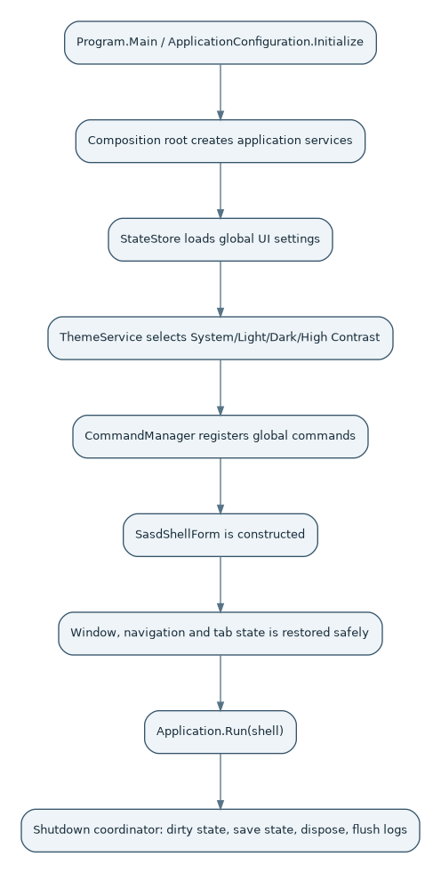

1. Configure process-wide WinForms settings, DPI and unhandled-error policy.
2. Load bootstrap configuration without secrets in UI state.
3. Build the service graph and validate required registrations.
4. Load theme and icons; fall back safely on invalid custom theme data.
5. Create the state store and run schema migrations.
6. Construct the main shell.
7. Restore safe window and shell state after handle creation.
8. Register pages and commands.
9. Display the application.
10. During shutdown, request dirty-state confirmation, persist state atomically, dispose adapter hosts and release services.

## 9.3 View lifecycle

A view transitions through construction, design-time preview or runtime activation, optional state restoration, active use, deactivation, state capture and disposal. Event subscriptions to long-lived services are removed explicitly or use a weak/owned subscription mechanism. A closed view must become garbage-collectable.

# 10. Design system, themes and icons

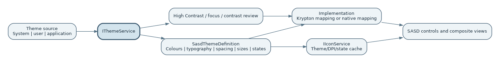

## 10.1 Design tokens as stable semantics

Tokens describe meaning rather than vendor properties. For example, `Surface`, `Primary`, `Error`, `Spacing.Medium` and `Input.MinimumHeight` are stable. Krypton palette members are implementation details. Tokens are immutable at runtime; switching theme replaces the active token set and raises a versioned change event.

## 10.2 Theme service

`IThemeService` exposes active definition, supported modes and a change event. Components read theme data through the service or their visual implementation; they do not poll operating-system settings independently. Theme changes are executed on the UI thread and batched to reduce flicker.

## 10.3 Krypton as an implementation

`Sasd.Ui.WinForms.Krypton` maps tokens and SASD component contracts to Krypton. The package may use Krypton types internally. It does not redefine application contracts and may be replaced by a native implementation.

## 10.4 Icon architecture

`IIconService` resolves semantic icon IDs to an image for theme, target pixel size, DPI and state. Cache ownership and disposal are centralised. The service provides a fallback glyph and diagnostics for missing icons. Accessible text remains separate from artwork.

# 11. Form, validation and view architecture

## 11.1 Base classes

Base classes contain only cross-cutting lifecycle behaviour. They expose protected extension hooks rather than virtual methods for every event. Domain logic is moved to presenters/controllers or application services.

## 11.2 `SasdFieldLayout`

The field layout composes standard controls in a semantic grid. It maintains label association, required indicator, help and error region. It supports both designer-created rows and runtime row definitions. Responsive changes are limited to defined layout modes to avoid unpredictable desktop resizing.

## 11.3 Validation architecture

Validation is a pipeline:

```text
control value
  -> binding/parser
  -> DataAnnotations and synchronous rules
  -> optional asynchronous application validator
  -> validation result collection
  -> ErrorProvider + ValidationSummary + command state
```

Rules return user-safe messages and severity. The coordinator handles cancellation of stale asynchronous validation and never blocks the UI thread.

## 11.4 Presenter/controller pattern

A presenter/controller is recommended when a view contains reusable interaction logic, asynchronous operations or complex command state. It receives interfaces for dialogs, state and application services and updates a small view contract. Simple forms may remain code-behind; the platform does not mandate heavyweight MVP/MVVM everywhere.

# 12. Shell, navigation and command architecture

## 12.1 Shell variants

The same shell contracts support:

- CRUD/list-detail applications;
- workbench/document applications;
- utility/settings applications;
- R2 dashboards.

Variants configure regions rather than subclassing a deep hierarchy.

## 12.2 Command system

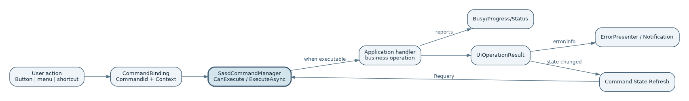

A command owns ID, text, description, icon, shortcut, visibility, enabled/checked state and execution. Surfaces subscribe to state changes. Execution uses a central runner that prevents accidental double execution when configured, creates cancellation context, displays busy/progress feedback and routes errors to the presenter.

Command IDs are stable because shortcuts, telemetry and persisted customisation may reference them. Business commands remain in the application; the platform provides infrastructure commands such as navigation, copy, refresh, save-layout and open-help.

## 12.3 Navigation

`INavigationService` resolves stable route/page IDs through an application-supplied registry. It runs leave guards, closes or reuses views according to policy, updates breadcrumb/history and publishes a result. The service does not keep closed Forms alive.

## 12.4 Document tabs and dirty state

Document identity is separate from the view instance. A document descriptor includes a safe reopen reference and dirty state. Close and application shutdown consult document guards. State restoration reopens only validated descriptors.

## 12.5 Status messages

Status messages include severity, source, priority, timestamp and optional lifetime. A higher-priority persistent error is not immediately overwritten by a transient “Ready” message.

# 13. Data presentation, grid, list and tree architecture

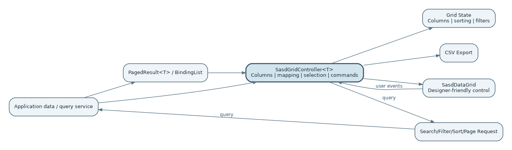

## 13.1 Separation of control and typed controller

The designer hosts non-generic `SasdDataGrid`. `SasdGridController<T>` owns typed columns, mappings, commands and selection. This permits compile-time support while preserving designer reliability.

## 13.2 Query models

Vendor-neutral records describe sorting, filtering and paging:

```csharp
public sealed record DataQuery(
    int Offset,
    int Limit,
    IReadOnlyList<SortDescriptor> Sort,
    FilterExpression? Filter,
    string? SearchText);

public interface IDataPageSource<T>
{
    Task<DataPage<T>> LoadAsync(
        DataQuery query,
        CancellationToken cancellationToken = default);
}
```

The platform never translates these models directly to SQL. Applications adapt them to their repositories and enforce authorisation and domain rules.

## 13.3 R1 functional boundary

R1 provides common business-grid capabilities but is not a spreadsheet. It deliberately excludes formula engines, merged cells, arbitrary cell canvases, pivot/OLAP and Excel-level editing semantics.

## 13.4 Lists and trees

List and tree providers support cancellation and asynchronous lazy loading. Tree failures remain local to a node where possible. Node models contain stable IDs and display data, not file handles or long-lived repository contexts.

## 13.5 UI state for data views

State captures column order/width/visibility, sorting, approved filters, selected view profile and expansion where safe. It is namespaced by application, view and schema version. State never serialises arbitrary row objects.

# 14. Dialog, feedback, progress and error architecture

## 14.1 Dialog service

Dialog contracts are model-based and return typed results. The concrete implementation chooses native Task Dialog, SASD form or a specialised selector based on capability and accessibility. Owner window and UI-thread rules are centralised.

## 14.2 Error flow

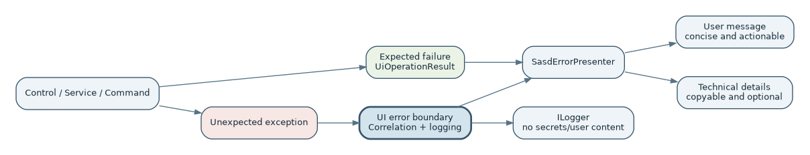

Expected errors return `UiOperationResult`. Unexpected exceptions are translated at the nearest meaningful boundary into a user message, technical record and correlation ID. The error presenter shows safe details and logs structured context. Fatal errors trigger controlled shutdown only when continuing would risk corruption.

## 14.3 Notifications

Notifications are an in-process queue service. Presentation surfaces may be shell snackbars or, in an optional adapter, Windows notifications. The message model is independent of either renderer.

## 14.4 Progress and busy

Busy state is scoped and reference-counted so nested operations do not hide each other prematurely. Progress models support indeterminate or percentage state, status text and cancellation. UI updates are throttled to avoid flooding the message pump.

# 15. State, file and Windows integration architecture

## 15.1 UI state

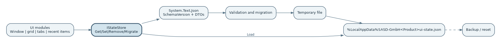

`SasdStateStore` writes versioned JSON to a product-specific LocalAppData directory. The sequence is read → validate → migrate → apply. Writes go to a temporary file, are flushed, and replace the previous file atomically where supported. A last-known-good backup may be retained.

## 15.2 State classes

State DTOs are simple, explicit and forward-tolerant. They contain schema version and component identity. Runtime controls are never serialised. Each module owns its migrations and can reset only its own section.

## 15.3 File and folder dialogs

The service returns selected paths plus cancellation/status information. It does not open or parse content. Application code remains responsible for content validation, authorisation and business rules.

## 15.4 Clipboard and drag-and-drop

Both integrations treat incoming data as untrusted. Format, count, size and path policy are checked before application processing. UI feedback is provided without synchronous network probing on the message loop.

## 15.5 Safe shell integration

Opening an item uses explicit intent methods such as `OpenUrl`, `OpenFile` and `OpenFolder`. Scheme and path policy are validated. The service never offers a general “execute arbitrary command” method.

## 15.6 Tray

Tray state is owned by a disposable service with explicit application-exit integration. It distinguishes hiding a window from terminating the process and offers an always-reachable restore/exit path.

# 16. Optional R2/R3 adapters and feature modules

## 16.1 Common adapter rules

An adapter includes:

- an ADR and licence/maintenance assessment;
- a separate project and package;
- a mapping layer and minimal vendor-neutral contract where useful;
- a documented vendor-specific extension point only where justified;
- Gallery examples, lifecycle tests and known limitations;
- an exit strategy and upstream relationship.

## 16.2 Adapter overview

| Adapter | Primary dependency | Security/resource concern | Fallback |
| --- | --- | --- | --- |
| Charts | ScottPlot | Large data, render cost and export memory | Text/table representation or no chart |
| Animated dashboard | LiveCharts2, optional | Animation load and visual consistency | ScottPlot/KPI cards |
| Markdown | Markdig plus text editor/WebView2 | Untrusted HTML and script | Plain source view |
| Code editor | ScintillaNET | Native resource/lifecycle and huge files | Multiline text control |
| Diff | DiffPlex | Memory for large documents | Summary or external comparison |
| Image | Cyotek ImageBox pilot | Bitmap/GDI ownership | PictureBox-based viewer |
| Barcode | QRCoder/ZXing.Net | Input limits and image resources | Service unavailable with clear result |
| PDF | PDFsharp/MigraDoc | Font/resource and file-output safety | HTML/text export where application supports it |
| Web host | WebView2 | Web content trust boundary | External browser or disabled preview |
| Docking | Krypton Workspace/Docking | Corrupted layout and event retention | Fixed split-panel layout |
| Property editor | Native PropertyGrid or approved option | Reflection and unintended writable properties | Read-only details panel |
| Ribbon | Krypton Ribbon | Complexity and keyboard/accessibility | Command bar/menu |

## 16.3 WebView2 security boundary

WebView2 is treated as a browser trust boundary. The host uses an origin allow-list, restricts navigation/new windows/downloads, validates message schemas, does not expose arbitrary host objects and provides a deliberate DevTools policy. Local file URLs are avoided in favour of virtual-host resource mapping.

# 17. Public API and extension points

## 17.1 API principles

- Prefer small interfaces and immutable option/result records.
- Avoid static mutable global state.
- Events follow .NET conventions and document thread context.
- Async APIs accept cancellation.
- Collections are exposed read-only unless mutation is the purpose.
- Nullability annotations are authoritative.
- Public APIs avoid vendor types except inside named adapters.
- Default behaviour is safe and useful; advanced behaviour is opt-in.

## 17.2 Supported extension points

Applications may provide:

- page and command registrations;
- validators and field adapters;
- data page/tree providers;
- icon packs and theme definitions within schema;
- state migrations for application-owned sections;
- dialog models and custom dialog views;
- chart series builders inside the chart adapter;
- editor syntax definitions;
- file/path policy and WebView origin policy.

## 17.3 Prohibited extension patterns

- arbitrary service resolution from controls;
- application domain types embedded in platform packages;
- reflection scans of all loaded assemblies without opt-in;
- unbounded global event buses;
- application code reaching through a SASD façade to mutate internal vendor controls;
- subclassing internal implementation types;
- serialising controls or service objects to state files.

# 18. Threading, lifecycle and resource management

## 18.1 UI-thread model

WinForms controls are single-thread-affine. `SasdUiDispatcher` is the only platform helper for switching to the UI thread. Services document whether callbacks occur on the UI thread. Background work never reads or mutates controls directly.

## 18.2 Async rules

- Avoid `async void` except event handlers.
- Every cancellable long operation accepts `CancellationToken`.
- Stale search, validation and paging results are discarded.
- Configure-await choices are made by layer; UI continuations explicitly return through the dispatcher.
- Busy/progress scopes are disposed in `finally`.
- Exceptions are observed and routed; fire-and-forget requires an approved helper.

## 18.3 Disposal and events

The creator owns disposable controls/resources unless a contract says otherwise. Cached images are owned by the cache. Views unsubscribe from long-lived services. Adapter hosts expose deterministic shutdown. Event lambdas that capture a view are reviewed carefully.

## 18.4 Resource budgets

| Resource | Rule |
| --- | --- |
| GDI images/fonts/brushes | Reuse immutable resources where possible; dispose owned dynamic objects. |
| USER/GDI handles | Monitor during repeated open/close tests. |
| Threads/tasks | No permanent thread per component; use asynchronous operations and bounded workers. |
| Timers | Dispose with owner; pause when view inactive if appropriate. |
| WebView/editor processes | Start lazily and close with host. |
| Caches | Bounded by item count or memory policy; clear on theme/disposal when required. |

# 19. Security architecture

## 19.1 Protected assets

- local user files and paths;
- clipboard contents;
- application data shown in controls;
- log files and technical diagnostics;
- state files and recent-item history;
- embedded web content and message bridge;
- dependency integrity and release artefacts.

## 19.2 Trust boundaries

| Boundary | Threat | Control |
| --- | --- | --- |
| File/drag-drop into application | Spoofed extension, huge file, network delay or malicious content | Application validation contract, limits, async checks and no automatic execution |
| Clipboard | Untrusted HTML/files and temporary lock | Format validation, retries and no execution |
| Shell | Dangerous URI or command injection | Intent-specific API, scheme allow-list and no arbitrary command method |
| WebView2 | Web-to-host privilege crossing | Origin policy, typed messages, disabled host objects and restricted capabilities |
| State JSON | Corruption/tampering and unsafe paths | Schema validation, safe DTOs, reset/migration and no secrets |
| Third-party packages | Vulnerability, licence drift or compromised supply chain | Locking, scanning, SBOM, notices, provenance and review |

## 19.3 Secrets

The UI Platform does not persist credentials, tokens or private keys. It may display a secret input control configured by an application, but storage and retrieval remain application-owned. Logs redact or omit sensitive values.

## 19.4 Dependency security

Dependencies use central version management and lock files where practical. CI scans known vulnerabilities and licences. Release artefacts include SBOM and third-party notices. High-severity findings block release unless formally accepted with mitigation.

# 20. Quality, performance, DPI and accessibility architecture

## 20.1 DPI and multi-monitor

AutoScale settings, manifests and templates are centralised. Layout panels and semantic sizes replace hard-coded coordinates. Per-monitor transitions are tested. Visual regression baselines are separated by DPI/theme/culture.

## 20.2 Accessibility

Accessibility is part of the public component contract. Composite controls expose meaningful accessible objects, names, roles, values and states. Keyboard order, activation, focus visibility and error association are defined and tested. High Contrast uses system semantics rather than decorative colour substitution.

## 20.3 Localisation

Shared resources are satellite-resource capable. Control layout tolerates expansion. Persisted IDs remain language-neutral. Formatting is culture-aware while state and protocol values remain invariant.

## 20.4 Performance principles

- Lazy creation for expensive optional hosts.
- Debounce and cancellation for search/validation.
- Paging/virtualisation for large data.
- Batch theme/layout updates.
- Avoid reflection in hot paint/data paths.
- Do not synchronously access network or disk from UI events.
- Measure with Gallery/reference scenarios before optimising.

## 20.5 Resilience

Each module defines fallback behaviour. Missing icon uses a fallback; invalid state resets; chart/editor adapter failure disables the feature; logging failure does not crash the UI; unsupported theme state falls back to the standard theme.

# 21. Test architecture

## 21.1 Test pyramid

| Layer | Responsibility |
| --- | --- |
| Unit | Pure contracts, tokens, commands, filters, state migrations, validators and result mapping. |
| Architecture | Dependency and public-API rules. |
| Integration | File/state/PDF/barcode adapters with controlled hosts and temporary data. |
| UI automation | Representative user flows through stable AutomationIds. |
| Visual regression | Rendered states across theme, DPI and culture. |
| Manual exploratory | Designer, mixed monitors, High Contrast and assistive-technology-oriented review. |

## 21.2 Component Gallery as executable specification

The Gallery is the primary visual acceptance host. Every released component includes states, sample code, requirements, accessibility notes, failure examples and known limitations. Screenshot baselines are generated from deterministic sample data.

## 21.3 Testability through architecture

Services are represented by small interfaces. Time, file dialogs, clipboard, state paths and data providers can be replaced with fakes. Controllers are testable without creating windows. UI automation identifies controls through stable IDs rather than captions alone.

# 22. Build, CI/CD, release and supply-chain architecture

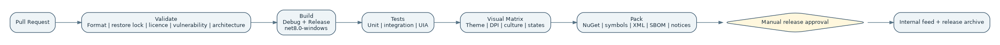

## 22.1 Build configuration

Central props configure nullable analysis, warnings, deterministic builds, documentation, source linking, package metadata and analysers. Package versions are centralised. SDK selection is reproducible.

## 22.2 Pipeline gates

1. formatting, restore and repository validation;
2. compile Debug and Release;
3. unit, architecture and integration tests;
4. Windows UI smoke tests;
5. dedicated visual/DPI matrix;
6. dependency, vulnerability and licence checks;
7. package, symbols, docs, SBOM and notices;
8. internal publication after approval;
9. release notes and tag.

Generated packages are immutable. The build that was tested is the build that is published.

## 22.3 Versioning

The repository uses a coordinated version while packages are young. SemVer and an API baseline protect consumers. Adapter packages may later version independently only if the operational benefit exceeds complexity.

# 23. Distribution and use in SASD applications

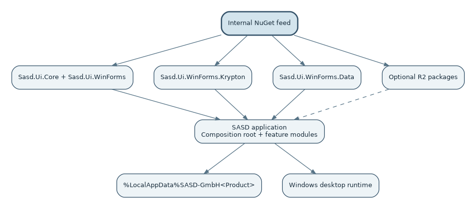

## 23.1 Distribution model

During R0/R1 packages are published to a private feed and accompanied by source-link symbols, XML docs and release notes. Public NuGet publication is a separate business/governance decision after API and licence review.

## 23.2 Consuming application structure

```text
Application/
├─ Domain/                  business model and rules
├─ Application/             use cases and ports
├─ Infrastructure/          databases, files and external services
├─ Presentation.WinForms/
│  ├─ Composition/
│  ├─ Shell/
│  ├─ Views/
│  ├─ Presenters/
│  └─ Resources/
└─ tests/
```

The platform belongs only in the presentation/composition areas. Domain and application projects do not reference WinForms packages.

## 23.3 Compatibility

Native WinForms controls remain supported inside SASD layouts. Applications may migrate surface by surface. A platform upgrade provides release notes and migration guidance. Public breaking changes require a major version after 1.0.

# 24. Migration and adoption

## 24.1 Strangler approach

1. Inventory duplicated UI helpers and local component customisations.
2. Introduce Core, theme and dialog services without redesigning screens.
3. Migrate one low-risk form or utility view.
4. Replace local state/search/filter helpers.
5. Introduce shell/navigation only where the application's structure benefits.
6. Remove duplicated code after package adoption is proven.
7. Add optional adapters only for a real use case.

## 24.2 Pilot applications

Prompt Manager is the primary R1 business pilot because it exercises forms, search, tags/categories, grids, dialogs and persistence. Mail Workbench and Notes validate workbench/document patterns. A small utility validates tray and Windows integration.

## 24.3 Migration compatibility

Temporary compatibility adapters may bridge existing helper APIs, but are marked obsolete with removal milestones. Application-specific visual quirks are not automatically promoted into the platform.

# 25. Risks, trade-offs and deliberate compromises

| Decision/trade-off | Benefit | Cost/risk | Response |
| --- | --- | --- | --- |
| WinForms first | Fast reuse in current products | Not cross-platform and older rendering model | Explicit product boundary and future register |
| Krypton pilot | Modern consistent visual base | Supplier dependency and theme edge cases | Isolated package and native fallback |
| Few public R1 packages | Easy consumption | Internal modules are less independently versioned | Keep repository project boundaries |
| No primitive wrapper set | Lower maintenance and better designer familiarity | Some native/Krypton API remains visible | Standardise behaviour through layout/services |
| Controller beside DataGrid | Typed logic and designer reliability | Two collaborating objects | Templates and examples reduce friction |
| JSON UI state | Simple, inspectable and migratable | Not suited to business data or concurrency | Strict scope and atomic writes |
| Optional specialist adapters | Small core and replaceability | More packages and integration testing | Shared adapter checklist and Gallery |
| No universal cross-platform core | Better WinForms ergonomics | Future implementations cannot reuse all code | Reuse semantics and documents, not forced binaries |

# 26. Architecture decisions (ADR register)

| ADR | Decision |
| --- | --- |
| ADR-0001 | WinForms and .NET 8 are the R0/R1 platform. |
| ADR-0002 | Use a modular monorepo with few initially published packages. |
| ADR-0003 | Design tokens and a theme service form the visual semantic layer. |
| ADR-0004 | Pilot Krypton first while preserving native WinForms fallback. |
| ADR-0005 | Do not create blanket wrappers for primitive controls. |
| ADR-0006 | Use an application composition root, not a service locator inside controls. |
| ADR-0007 | Separate `SasdGridController<T>` from the non-generic designer control. |
| ADR-0008 | Store versioned JSON UI state under LocalAppData. |
| ADR-0009 | Isolate third-party libraries through adapter and package boundaries. |
| ADR-0010 | Use ScottPlot as the primary R2 chart pilot. |
| ADR-0011 | Package ScintillaNET as a separate code-editor adapter. |
| ADR-0012 | Use WebView2 with a default-deny security profile. |
| ADR-0013 | Combine UI automation, visual regression and manual accessibility review. |
| ADR-0014 | Use an internal NuGet feed before public release. |
| ADR-0015 | Exclude mobile, macOS and Linux desktop implementations from current scope. |
| ADR-0016 | Treat WPF, ASPX/Web and Java as separate future product lines. |

The detailed rationale and consequences are maintained in `docs/en/project/adr/`.

# 27. Traceability and release gates

## 27.1 Mapping to functional-specification areas

| Architecture area | Functional-specification chapters |
| --- | --- |
| Core/module/package architecture | 4–6 and 16 |
| Theme, forms and visual foundation | 7–8 |
| Component catalogue | 9 |
| Shell/commands/navigation | 10 |
| Data views | 11 |
| Dialog/error/progress | 12 |
| Windows and state | 13 |
| Optional adapters | 14 |
| Quality and test | 15 |
| Gallery, templates and adoption | 17–18 |
| Risk and scope boundaries | 19–21 |

## 27.2 Architecture release gates

| Gate | Architecture evidence |
| --- | --- |
| R0 architecture | Approved module graph, ADRs, public contracts and architecture-test skeleton. |
| R0 visual | Token/Krypton/native comparison and designer/DPI/accessibility results. |
| R1 alpha | No forbidden dependencies; Component Gallery exercises every R1 module. |
| R1 beta | Two real applications consume packages; state and migration behaviour proven. |
| R1 release | API baseline, SBOM, package docs, resource tests and architecture review accepted. |
| R2 adapter release | Adapter checklist, isolation, security/lifecycle tests and fallback documented. |

# 28. Future boundaries and platform register

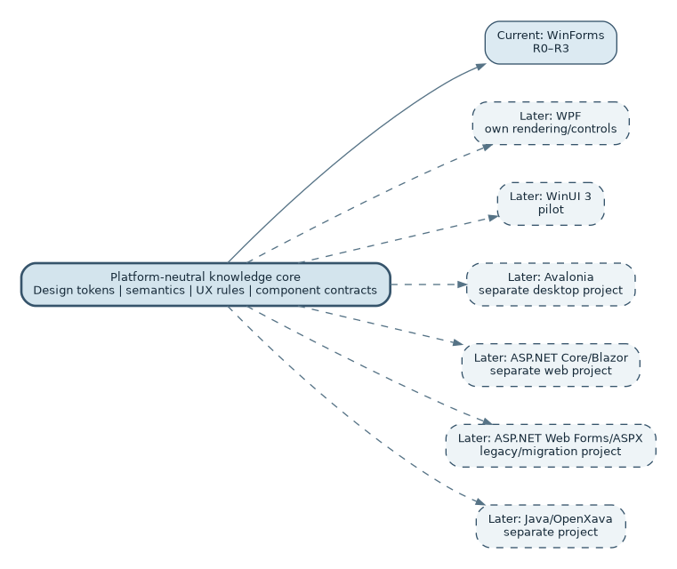

## 28.1 Deliberately reusable concepts

The following may inform later implementations:

- semantic design tokens;
- command and navigation concepts;
- result/error and validation models;
- query/filter descriptions;
- state schema ideas;
- quality checklists, accessibility criteria and ADR process;
- component naming and Gallery scenarios.

This does not imply that current WinForms assemblies must be referenced by WPF, Web or Java.

## 28.2 Deferred projects

| Future line | Relationship to current architecture |
| --- | --- |
| SASD WPF Components | Re-evaluate tokens and contracts, use native XAML/MVVM patterns. |
| WinUI 3 pilot | Compare current Windows direction and deployment/runtime constraints. |
| Avalonia pilot | Evaluate cross-platform desktop only when a real requirement exists. |
| SASD Web Components | Separate Blazor/modern web implementation; share semantics and documentation. |
| ASP.NET Web Forms compatibility | Legacy/migration project; AJAX Control Toolkit as historical feature source only. |
| SASD Java Business UI | Separate Java/OpenXava evaluation and architecture. |
| Mobile/macOS/Linux desktop | Not planned; retained only as a future option. |

# 29. Architecture acceptance and review checklist

The architecture is acceptable when reviewers can answer **yes** to all of the following:

- Is every module's responsibility explicit and non-overlapping?
- Is the dependency direction enforceable automatically?
- Can the R1 core run without R2/R3 dependencies?
- Can Krypton be replaced without changing application domain code?
- Can visual controls be used safely in the WinForms Designer?
- Are state files versioned, atomic and limited to UI data?
- Are business databases and ORMs outside the platform?
- Are UI-thread, cancellation and disposal rules explicit?
- Are file, shell, clipboard and WebView trust boundaries addressed?
- Are DPI, accessibility, localisation and visual regression release gates?
- Is every third-party dependency owned by a package and an exit strategy?
- Can existing applications migrate incrementally?
- Are future platforms recorded without diluting the current implementation?

# 30. Appendices

## 30.1 Public R1 component core

- Base: `SasdForm`, `SasdDialogForm`, `SasdUserControl`, `SasdSectionPanel`, `SasdSearchBox`, `SasdEmptyState`, `SasdBusyOverlay`, `SasdUiDispatcher`.
- Forms: `SasdFieldLayout`, `SasdValidationSummary`, validation coordinator and field adapters.
- Shell/commands: `SasdShellForm`, navigation, breadcrumb, document tabs, command bar and status service.
- Data: `SasdDataGrid`, `SasdGridController<T>`, list, tree, filter bar, paging contracts and CSV export.
- Dialogs: dialog, error, notification and progress services.
- Windows: file dialog, clipboard, drag/drop, tray and safe shell services.
- State: versioned state store, migrations and recent items.
- Visual implementation: approved Krypton adapter and icon/theme services.

## 30.2 R2/R3 register

- Charts and KPI;
- Markdown, code and diff editors;
- image, QR/barcode and PDF;
- WebView2;
- docking/workspace;
- property editor and advanced grid views;
- optional wizard and ribbon.

## 30.3 Terms

| Term | Meaning |
| --- | --- |
| Adapter | Package that integrates a third-party technology behind an owned boundary. |
| Component | Visual control, composite control, controller or service delivered by the platform. |
| Composition root | Application-owned location where concrete services and modules are assembled. |
| Design token | Semantic visual value such as colour, typography, spacing or size. |
| Gallery | Executable catalogue and acceptance host for components and states. |
| UI state | Non-business user-interface preferences and layout data. |
| Vendor leak | Third-party type appearing outside its approved adapter boundary. |

## 30.4 Document control

| Version | Date | Status | Change |
| --- | --- | --- | --- |
| 0.1 | 23 July 2026 | Baseline draft | Initial architecture derived from requirements and functional specification; module, runtime, package, quality and delivery architecture established. |

## 30.5 Decision basis

This architecture is based on the WinForms-focused component catalogue, the approved scope of the requirements specification, the implementation commitments in the functional specification and the supplementary project documents and ADRs. Where future implementation evidence contradicts an assumption, the relevant ADR and this document must be updated before the architecture is changed in code.

**End of architecture document**
